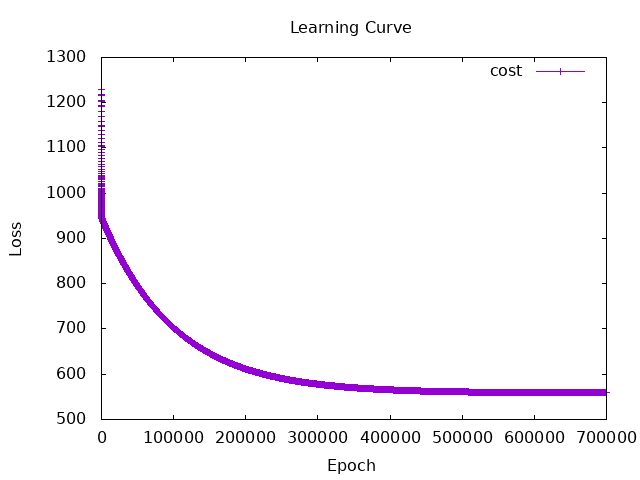
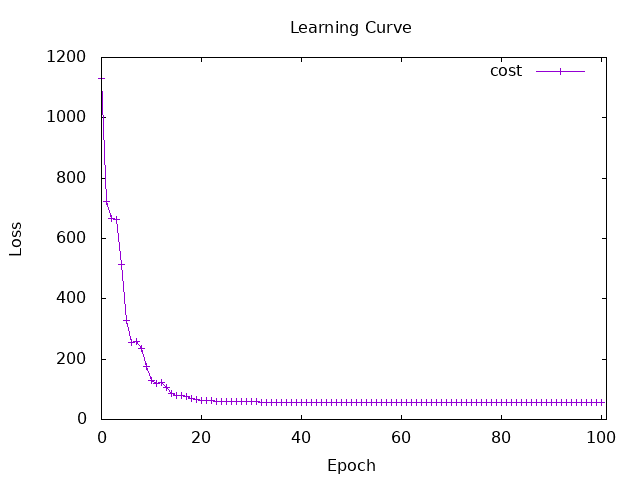
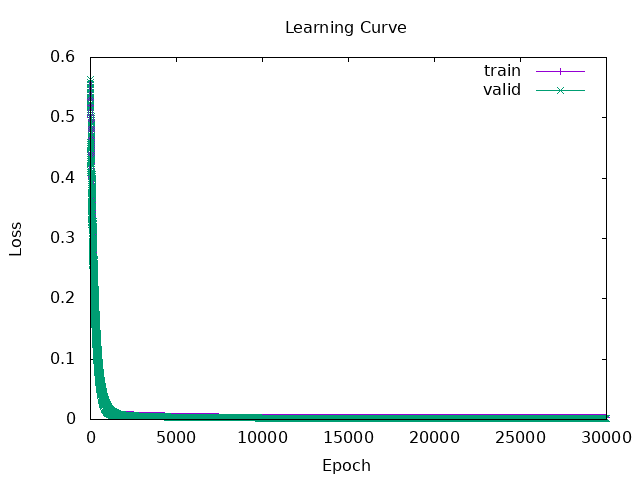

# Session 3

## 3. Train linear regression model from scratch with sample data

### about function
-linear function : Calculates predictions using the formula `y = ax + b`.
-cost function : Calculate the loss between the predicted values and the true values.
-calculateNewA function : It updates parameter `a` by Gradient Descent Algorithm. 
    It calculates the numerical gradient using a small value `e` with `(cost(a + e) - cost(a)) / e`. 
    Then it updates `a` using `newA = a - learnRate * grad`.
- calculateNewB function : It updates parameter `b`.
- trainLoop function : Recursive function. It calls itself with `epoch - 1`
    When `epoch` is 0, it returns the final `(a, b)` and the cost list.

### learning rate and epoch
About learning rate
- If it is too high, the cost become divergence.
- If it is too low, the learning stopped early with a high cost like about 900.  

About epoch
- I set the epoch size large enough so that the learning curve shows the cost dropping and converging.

### Final Result
- Epoch: 700000
- Learning Rate: 0.000056
- Final A (slope): 0.5675638
- Final B (intercept): 92.06035
- Final Cost: 558.97943

### Learning Curve

↑ The learning curve dropped smoothly from the initial value and stabilized. 
  Since parameters `a` and `b` reached near the ideal values, I think the model was trained very well.

## 4. multiple linear regression model 
### Final Result
- Epoch: 100
- Learning Rate: 0.000052 
- Final A1 (slope1): 0.6053912
- Final A2 (slope2): 0.44135213
- Final B (intercept): 0.14706215
- Final Cost: 57.53576

### Learning Curve

↑ The loss decreased more rapidly than in the single variable model. 
  Since parameters `a1`, `a2` and `b` reached near the ideal values, I think the model was trained well.
 

## 5. Predict something with Linear Regression
I predicted the **Chance of Admit** (ranging from 0 to 1) using **Undergraduate GPA** (out of 10).

### about function
- loadData function: It takes a file path and converts the CSV data into a tensor.
- In `trainLoop`, I passed both `train.csv` and `valid.csv` data. 
    The training data was used to update the parameters, and the validation data was used to calculate the cost.

I used `eval.csv` to predict the response variable and check the final model behavior.

### Final Result
- Epoch: 30000
- Learning Rate: 0.0263
- Final A (slope): 0.19289789
- Final B (intercept): -0.93681604
- Final Cost: 2.2795638e-3

### Learning Curve

↑ The learning curve for the training data and the curve for the validation data have almost the same shape. 
  This indicates that overfitting did not occur, and the model also fits well to unknown data.