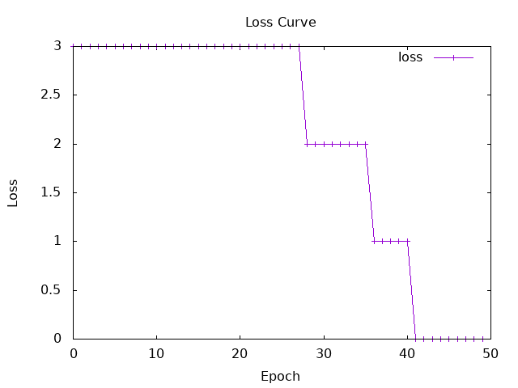
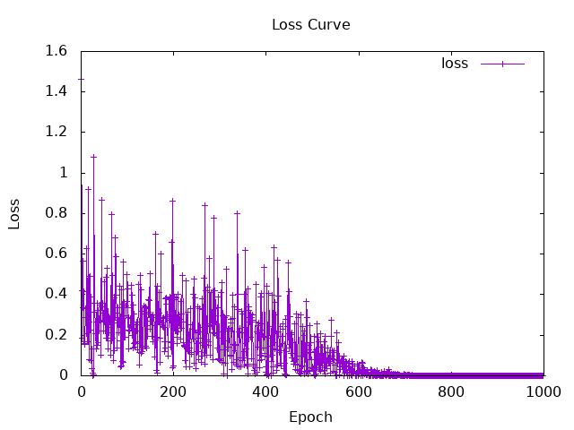
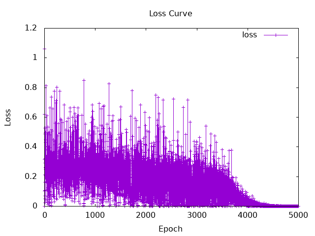

# Session4

## Understanding the Concepts
### Single-layer perceptron :
- The perceptron is a one-layer neural network that can classify things into two parts.
- It has an input layer and an output layer.
- Assign weights to each input value, sum them up with a bias, and pass the result to an activation function.

### Multi-layer perceptron :
- A large-scale neural network constructed by combining single perceptrons.
- It has an input layer, multiple hidden layers, and an output layer.
- It is more suitable than a simple perceptron for solving XOR because it can solve non-linear classification. 

### Activation functions
- step function    :  if argument is greater than 0 , it returns 1 else 0
- sigmoid function :  It returns maps values to a range between 0 and 1
- tanh             :  It returns a value from -1 to 1
- ReLU             :  It returns the maximum value of 0 and argument x
- Leaky ReLU       :  It prevents neurons from dying by assigning a small weight to negative values
- softmax

### Backpropagation : 
- Even if the form of `f(x)` is unknown, calculating `f'(x)` allows for finding local minimam value.
- Differentiating the loss function at the output layer reveals which and how much weights should be adjusted.
- Backpropagation isn’t  be used with step functions because they are not continuous.


## Hands-on tasks
### 1 
Build and train an AND gate using a simple perceptron  
#### results
```
Prediction: [1.0,0.0,0.0,0.0]
Final Weights: [0.33418733,0.10479676]
Final Bias: -0.34385663
```


### 2.b
Build and train a XOR gate using a multi-layer perceptron 

#### MLP Structure Definition
```haskell
data MLPSpec = MLPSpec
  { feature_counts :: [Int],              -- List of unit counts 
    nonlinearitySpec :: Tensor -> Tensor  -- activate function
  }
```
(example) input layer=2, hidden layer=3, output layer=1   ->   `feature_counts = [2,3,1] `

#### MLP data type
```haskell
data MLP = MLP
  { layers :: [Linear],                -- List of weights and bias 
    nonlinearity :: Tensor -> Tensor   -- activate function
  }
```
`data Linear = Linear {weight :: Parameter, bias :: Parameter}`

#### Initalize MLP model by random value
```haskell
instance Randomizable MLPSpec MLP where 
  sample MLPSpec {..} = do
    let layer_sizes = mkLayerSizes feature_counts -- Create a linked list by pairing the sizes of adjacent layers [(input,output)]
    linears <- mapM sample $ map (uncurry LinearSpec) layer_sizes      -- initialize by random value
    return $ MLP {layers = linears, nonlinearity = nonlinearitySpec}
    where
      mkLayerSizes (a : (b : t)) =
        scanl shift (a, b) t
        where
          shift (a, b) c = (b, c)
```
`data LinearSpec = LinearSpec {in_features :: Int, out_features :: Int}`  
`class Randomizable spec f | spec -> f where    
  sample :: spec -> IO f`

`LinearSpec`: it stores the number of inputs and outputs for a single layer  
`sample` : Takes a `LinearSpec` and returns a `Linear` object with random initial values  

#### Calculate with MLP model
```haskell
mlp :: MLP -> Tensor -> Tensor 
mlp MLP {..} input = foldl' revApply input $ intersperse nonlinearity $ map linear layers 
  where
    revApply x f = f x
```
`map linear layers` : List of linear function like [wx1+b, wx2+b ... ]  
`intersperse nonlinearity` : Include the application of the activation function in the layer's calculation  

#### Initialize value
```haskell
batchSize = 2   
numIters = 2000  

model :: MLP -> Tensor -> Tensor
model params t = mlp params t      -- Set the MLP for the model you are using
```
`batchSize`  : Number of data points processed per training iteration  
`numIters`   : Number of training iterations  


#### main function
```haskell
init <- 
    sample $                             -- initialize weights and bias by random value
      MLPSpec
        { feature_counts = [2, 2, 1],    -- input layer=2, hidden layer=2、output layer=1　
          nonlinearitySpec = Torch.tanh  -- set the activation function to tanh
        }
```
↑ Initialize the model with the specified number of layers and activation function

```haskell
trained <- foldLoop init numIters $ \state i -> do
    input <- randIO' [batchSize, 2] >>= return . (toDType Float) . (gt 0.5)  
    let (y, y') = (tensorXOR input, squeezeAll $ model state input)         
        loss = mseLoss y y' 
    when (i `mod` 100 == 0) $ do
      putStrLn $ "Iteration: " ++ show i ++ " | Loss: " ++ show loss 
    (newState, _) <- runStep state optimizer loss 1e-1 
    return newState
```
`input`    : generated two random sets of input data for the XOR ex. [[0,1],[1,1]]   
`y`        : currect value   
`y'`       : estimated value  
`loss`     : Mean Squared Error of `y` and `y'`  
`1e-1`     : learning rate    
`newState` : new model after weight updates  

↑ Train the initialized model `init` for `numIters` iterations  


```haskell
where
    optimizer = GD 
    tensorXOR :: Tensor -> Tensor 
    tensorXOR t = (1 - (1 - a) * (1 - b)) * (1 - (a * b))
      where
        a = select 1 0 t
        b = select 1 1 t
```
`GD`        : Gradient Descent (勾配降下法)  
`tensorXOR` : A function that performs XOR operations   


### 2.d

#### step function
A runtime error occurred because step function is not continuous function.

#### tanh
learning rate = 1e-1  
numIters = 1000
```
Iteration: 100 | Loss: Tensor Float []  0.4997   
Iteration: 200 | Loss: Tensor Float []  0.2390   
Iteration: 300 | Loss: Tensor Float []  8.0503e-2
Iteration: 400 | Loss: Tensor Float []  4.3146e-2
Iteration: 500 | Loss: Tensor Float []  8.1531e-2
Iteration: 600 | Loss: Tensor Float []  5.0508e-2
Iteration: 700 | Loss: Tensor Float []  3.1344e-3
Iteration: 800 | Loss: Tensor Float []  8.1469e-5
Iteration: 900 | Loss: Tensor Float []  6.1959e-6
Iteration: 1000 | Loss: Tensor Float []  3.1173e-7
Final Model:
[0.0,0.0] => Tensor Float []  2.1011e-4
[0.0,1.0] => Tensor Float []  0.9996   
[1.0,0.0] => Tensor Float []  0.9998   
[1.0,1.0] => Tensor Float []  3.6639e-4
```
   
Convergence was faster compared to the sigmoid function.

#### sigmoid
learning rate = 1e-1  
numIters = 5000
```
Iteration: 500 | Loss: Tensor Float []  0.3460   
Iteration: 1000 | Loss: Tensor Float []  0.2596   
Iteration: 1500 | Loss: Tensor Float []  0.2854   
Iteration: 2000 | Loss: Tensor Float []  0.2985   
Iteration: 2500 | Loss: Tensor Float []  0.1208   
Iteration: 3000 | Loss: Tensor Float []  0.1041   
Iteration: 3500 | Loss: Tensor Float []  0.1223   
Iteration: 4000 | Loss: Tensor Float []  4.8736e-2
Iteration: 4500 | Loss: Tensor Float []  2.6326e-3
Iteration: 5000 | Loss: Tensor Float []  8.1762e-5
Final Model:
[0.0,0.0] => Tensor Float []  2.6968e-3
[0.0,1.0] => Tensor Float []  0.9932   
[1.0,0.0] => Tensor Float []  0.9952   
[1.0,1.0] => Tensor Float []  9.3691e-3
```
   
Convergence was slower compared to the tanh function.
