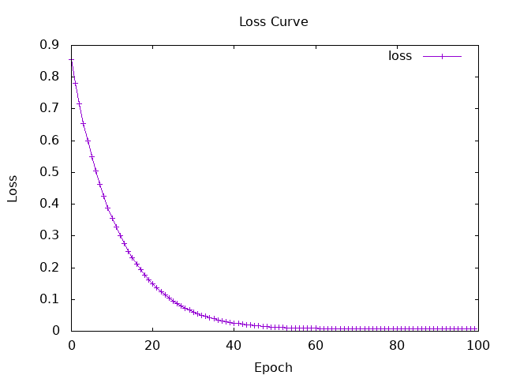
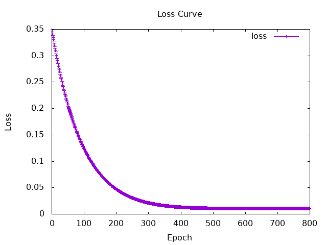
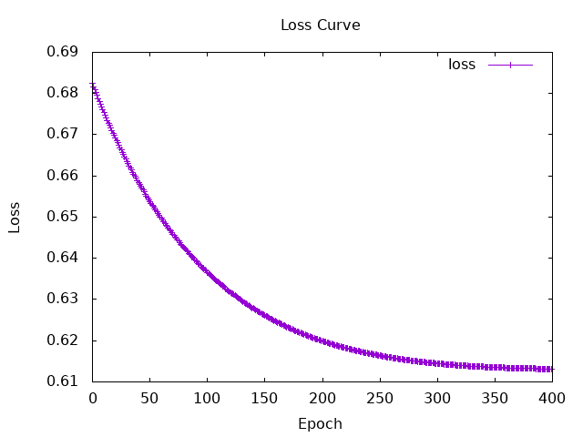
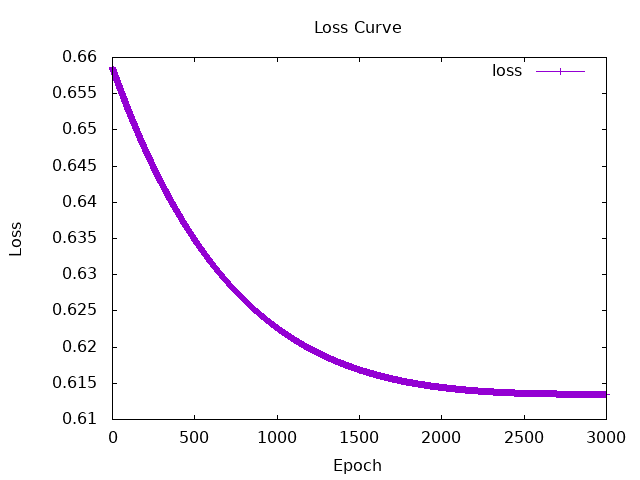
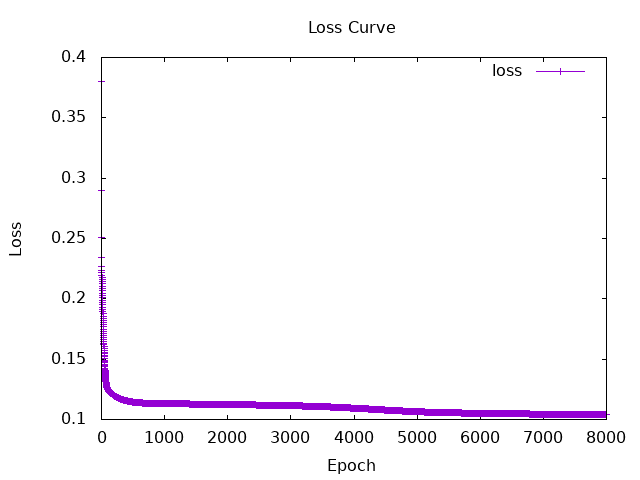

# Session5

## Hands-on tasks

### 3. evaluate model for Admit.hs

#### result of one time run
learning rate = 1e-2   
numIters = 100  
activation function = tanh  
layer = [7,8,8,1] 
```
Iteration: 100 | Loss: Tensor Float []  7.8303e-3
Confusion Matrix  : [[14,1],[2,23]]
accurary          : 0.925
macro-f1-Score    : 0.9210006
micro-f1-Score    : 0.925
weighted-f1-Score : 0.9254443
``` 
  
---
 
learning rate = 1e-3   
numIters = 800  
activation function = tanh  
layer = [7,8,8,1]   
```
Iteration: 100 | Loss: Tensor Float []  0.1251   
Iteration: 200 | Loss: Tensor Float []  4.7520e-2
Iteration: 300 | Loss: Tensor Float []  2.1318e-2
Iteration: 400 | Loss: Tensor Float []  1.3103e-2
Iteration: 500 | Loss: Tensor Float []  1.0943e-2
Iteration: 600 | Loss: Tensor Float []  1.0637e-2
Iteration: 700 | Loss: Tensor Float []  1.0776e-2
Iteration: 800 | Loss: Tensor Float []  1.0937e-2
Confusion Matrix  : [[12,3],[4,21]]
accurary          : 0.825
macro-f1-Score    : 0.8156682
micro-f1-Score    : 0.825
weighted-f1-Score : 0.8260369
```
    

---

#### average and variance of five time
learning rate = 1e-3   
numIters = 800  
activation function = tanh  
layer = [7,8,8,1]  

| metric | avarage | variable |
| --- | --- | --- |
| accurary | 0.80000 | 0.01075 | 
| macro-f1-Score | 0.78677 | 0.01157 | 
| micro-f1-Score | 0.80000 | 0.01075 | 
| weighted-f1-Score | 0.79643 | 0.01141 |

```
Confusion Matrix  : [[12,3],[4,21]]
accurary          : 0.825
macro-f1-Score    : 0.8156682
micro-f1-Score    : 0.825
weighted-f1-Score : 0.8260369

Confusion Matrix  : [[13,2],[2,23]]
accurary          : 0.9
macro-f1-Score    : 0.8933333
micro-f1-Score    : 0.9
weighted-f1-Score : 0.9

Confusion Matrix  : [[13,2],[13,12]]
accurary          : 0.625
macro-f1-Score    : 0.6247655
micro-f1-Score    : 0.625
weighted-f1-Score : 0.62242025

Confusion Matrix  : [[15,0],[4,21]]
accurary          : 0.9
macro-f1-Score    : 0.8976982
micro-f1-Score    : 0.9
weighted-f1-Score : 0.90153456

Confusion Matrix  : [[7,8],[2,23]]
accurary          : 0.75
macro-f1-Score    : 0.7023809
micro-f1-Score    : 0.75
weighted-f1-Score : 0.7321428
```
my-analyze:  The accuracy changed a lot (0.62 to 0.90) even with the same settings. This means the model's success depends on initial random weights. To get stable results, I may need higher learning rate.

### 4. loss functions  
#### a. report my survey
- **Mean Squared Error (MSE)**  
definition : The average of the squares of the errors between predictions and actual values.  
formula   : $E = - \frac{1}{N}\sum {(y-y')} $  
--- $y $ : actual value  
--- $y'$ : predicted value  
use cases : Regression problems 

---

-  **Cross entropy**  
*definition* : the product of the correct label and the natural logarithm of the prediction result   
*formula*    : $E = - \sum_{k} {t_k} \log{{y_k}} $  
--- $t_k$ : actual value   
--- $y_k$ : Predicted Probability  
*use cases* : classification problems  
---

- **Negative log-likelihood (NLL)**   
*definition* : A loss function that measures the likelihood of the true class under the predicted distribution  
*formula*    : $L(\theta) = - \log(P(y|x ; \theta))$  
--- $x$ : input data   
--- $y$ : actual label of output  
--- $\theta$ : parameters  
--- $P(y|x)$ : Conditional Probability / Likelihood  
*use cases*  : Multi-class classification problems  
---
-  **Kullback Leibler (KL) divergence**  
*definition* :  A function that calculates the amount of information lost by subtracting the entropy of the estimated model q(x) from the entropy of the actual data distribution p(x)  
*formula* : $KL(p || q) = \sum_{x} p(x) \log ( \frac{p(x)}{q(x)})$  
*use cases* : Variational Autoencoder (VAE)  

    (KL divergence = cross entropy - entropy)
---

#### b. compare the result of Ex.2 model using each loss function
loss function = **cross entropy**  
learning rate = **1e-2**  
numIters = 400  
activation function = tanh  
layer = [7,8,8,1] 
```
Iteration: 100 | Loss: Tensor Float []  0.6369   
Iteration: 200 | Loss: Tensor Float []  0.6200   
Iteration: 300 | Loss: Tensor Float []  0.6145   
Iteration: 400 | Loss: Tensor Float []  0.6131   
Confusion Matrix  : [[15,0],[4,21]]
accurary          : 0.9
macro-f1-Score    : 0.8976982
micro-f1-Score    : 0.9
weighted-f1-Score : 0.90153456
```
  
---

loss function = **cross entropy**  
learning rate = **1e-3**  
numIters = 3000  
activation function = tanh  
layer = [7,8,8,1]  
```
Iteration: 100 | Loss: Tensor Float []  0.6526   
Iteration: 200 | Loss: Tensor Float []  0.6473   
Iteration: 300 | Loss: Tensor Float []  0.6426   
Iteration: 400 | Loss: Tensor Float []  0.6385   
Iteration: 500 | Loss: Tensor Float []  0.6348   
Iteration: 600 | Loss: Tensor Float []  0.6317   
Iteration: 700 | Loss: Tensor Float []  0.6289   
Iteration: 800 | Loss: Tensor Float []  0.6265   
Iteration: 900 | Loss: Tensor Float []  0.6244   
Iteration: 1000 | Loss: Tensor Float []  0.6226   
Iteration: 1100 | Loss: Tensor Float []  0.6211   
Iteration: 1200 | Loss: Tensor Float []  0.6198   
Iteration: 1300 | Loss: Tensor Float []  0.6186   
Iteration: 1400 | Loss: Tensor Float []  0.6177   
Iteration: 1500 | Loss: Tensor Float []  0.6169   
Iteration: 1600 | Loss: Tensor Float []  0.6162   
Iteration: 1700 | Loss: Tensor Float []  0.6156   
Iteration: 1800 | Loss: Tensor Float []  0.6151   
Iteration: 1900 | Loss: Tensor Float []  0.6147   
Iteration: 2000 | Loss: Tensor Float []  0.6144   
Iteration: 2100 | Loss: Tensor Float []  0.6142   
Iteration: 2200 | Loss: Tensor Float []  0.6140   
Iteration: 2300 | Loss: Tensor Float []  0.6138   
Iteration: 2400 | Loss: Tensor Float []  0.6137   
Iteration: 2500 | Loss: Tensor Float []  0.6136   
Iteration: 2600 | Loss: Tensor Float []  0.6136   
Iteration: 2700 | Loss: Tensor Float []  0.6135   
Iteration: 2800 | Loss: Tensor Float []  0.6135   
Iteration: 2900 | Loss: Tensor Float []  0.6135   
Iteration: 3000 | Loss: Tensor Float []  0.6135   
Confusion Matrix  : [[14,1],[4,21]]
accurary          : 0.875
macro-f1-Score    : 0.87105095
micro-f1-Score    : 0.875
weighted-f1-Score : 0.8766924
```
     

analyze : 
When I use same learning rate, Using cross-entropy required more training iterations than using MSE as the loss function to achieve the same level of accuracy. 
 


### 5 Build classification model of Titanic dataset
b. **result**  
learning rate = 0.08  
numIters = 8000  
activation function = tanh  
layer = [7,16,16,1]  
```
Iteration: 1000 | Loss: Tensor Float []  0.1131   
Iteration: 2000 | Loss: Tensor Float []  0.1124   
Iteration: 3000 | Loss: Tensor Float []  0.1114   
Iteration: 4000 | Loss: Tensor Float []  0.1094   
Iteration: 5000 | Loss: Tensor Float []  0.1065   
Iteration: 6000 | Loss: Tensor Float []  0.1051   
Iteration: 7000 | Loss: Tensor Float []  0.1044   
Iteration: 8000 | Loss: Tensor Float []  0.1041   
Confusion Matrix  : [[52,4],[13,21]]
accurary          : 0.8111111
macro-f1-Score    : 0.7856842
micro-f1-Score    : 0.8111111
weighted-f1-Score : 0.8037292
```
  


