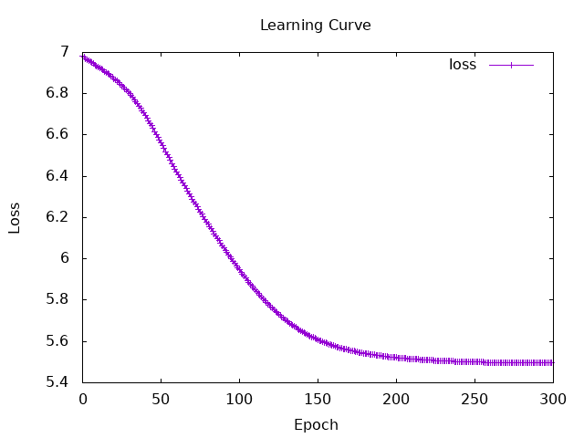
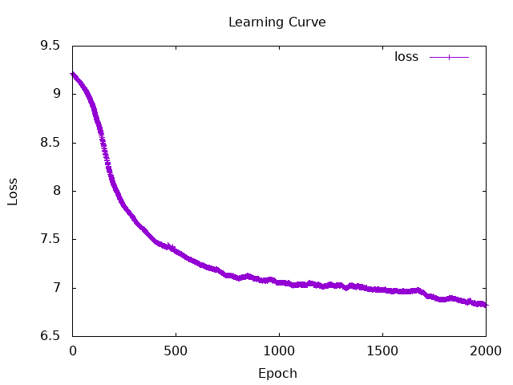
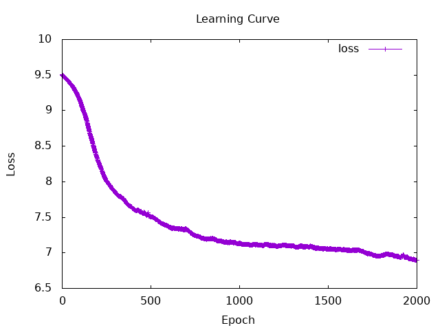

# Session 6
## Understanding the Concepts

### Bag of words　
- Put the words appearing in the text into a “bag” without regard to their order, and count the number of words.  
 → Vectorize the words based on their frequency of occurrence

-- Pros
- Fast at calculate

-- Cons
- The order of the words is ignored
- The meaning is ignored.  
    Example: The dog and the cat become vectors that are completely unrelated.

---
### word2Vec
- Learn the meaning of words from the surrounding context and represent them as multidimensional vectors
- Based on the hypothesis that “words used in similar contexts should have similar meanings”

-- Pros
- It can calculate the **similarity** between words
- It can add and subtract words  
    Example: king - men + women = queen   

-- Cons
- The caluculating cost is enormous
- It's hard for me to tell the difference when a word has different meanings, like 'like'.


#### Two Main Approach of Word2Vec

| model | approach |
| --- | --- |
| CBOW | Predict what word will appear in the center based on the surrounding words | 
| Skip-gram | Predict what words will appear around the central word | 


## Hands-on tasks
### 1. impliment of word2vec (I didn't try impliment of bag of words...)

I build the model o word2vec by skipgram.
and return vector of "it"

first, I tryed small data (**100** line)

```
numIters = 300
learnRate = 0.5 
wordDimension = 9
```

```
Iteration: 100 | Loss_valid: Tensor Float []  5.9568   | Loss_train: Tensor Float []  6.1235   
Iteration: 200 | Loss_valid: Tensor Float []  5.5226   | Loss_train: Tensor Float []  5.9358   
Iteration: 300 | Loss_valid: Tensor Float []  5.4955   | Loss_train: Tensor Float []  5.8793   
it : Tensor Float [1,9] [[-3.4590e-2,  3.5878e-2, -1.6550e-2,  5.4989e-2,  1.0719e-2,  3.9555e-2, -1.0255e-2, -1.4114e-2, -1.1525e-2]]
```
  

---

I tryed more big data but...
```
Killed
```
my-analyze: 
The data was too big and I passed all the data to train for per loop, so it cause memory luck. Then program was killed

↓ 

I implement mini-batch method
```haskell
-- split data for batch-size
let startIdx = (i * batchSize) `mod` (totalPairs - batchSize)
    batchPairs = Data.List.take batchSize $ drop startIdx pairs_train 
    batch_x = asTensor $ map fst batchPairs
    batch_y = asTensor $ map snd batchPairs

-- calculate loss
let y  = batch_y                      
    y' = forWard state batch_x            
    loss = nllLoss' y y'
```

---


After implement mini-batch method, I could run for **3000** line data
```
numIters = 2000
learnRate = 0.2 
wordDimension = 9
batchSize = 64
dataSize = 3000
```

<details>
<summary>Terminal Output (Click to view)</summary>

```
Iteration: 100 | Loss_valid: Tensor Float []  8.8771   | Loss_train: Tensor Float []  8.9405   
Iteration: 200 | Loss_valid: Tensor Float []  8.0665   | Loss_train: Tensor Float []  8.2209   
Iteration: 300 | Loss_valid: Tensor Float []  7.7070   | Loss_train: Tensor Float []  7.6866   
Iteration: 400 | Loss_valid: Tensor Float []  7.4849   | Loss_train: Tensor Float []  7.1913   
Iteration: 500 | Loss_valid: Tensor Float []  7.3779   | Loss_train: Tensor Float []  7.2807   
Iteration: 600 | Loss_valid: Tensor Float []  7.2633   | Loss_train: Tensor Float []  7.0576   
Iteration: 700 | Loss_valid: Tensor Float []  7.1913   | Loss_train: Tensor Float []  7.1155   
Iteration: 800 | Loss_valid: Tensor Float []  7.1011   | Loss_train: Tensor Float []  7.1409   
Iteration: 900 | Loss_valid: Tensor Float []  7.0936   | Loss_train: Tensor Float []  7.3083   
Iteration: 1000 | Loss_valid: Tensor Float []  7.0570   | Loss_train: Tensor Float []  7.2233   
Iteration: 1100 | Loss_valid: Tensor Float []  7.0374   | Loss_train: Tensor Float []  7.5160   
Iteration: 1200 | Loss_valid: Tensor Float []  7.0249   | Loss_train: Tensor Float []  6.7949   
Iteration: 1300 | Loss_valid: Tensor Float []  7.0304   | Loss_train: Tensor Float []  7.2458   
Iteration: 1400 | Loss_valid: Tensor Float []  7.0116   | Loss_train: Tensor Float []  6.8123   
Iteration: 1500 | Loss_valid: Tensor Float []  6.9795   | Loss_train: Tensor Float []  6.0761   
Iteration: 1600 | Loss_valid: Tensor Float []  6.9688   | Loss_train: Tensor Float []  7.0811   
Iteration: 1700 | Loss_valid: Tensor Float []  6.9520   | Loss_train: Tensor Float []  7.1491   
Iteration: 1800 | Loss_valid: Tensor Float []  6.8846   | Loss_train: Tensor Float []  7.2342   
Iteration: 1900 | Loss_valid: Tensor Float []  6.8570   | Loss_train: Tensor Float []  6.5406   
Iteration: 2000 | Loss_valid: Tensor Float []  6.8225   | Loss_train: Tensor Float []  6.9744   
it : Tensor Float [1,9] [[ 8.7134e-3,  2.9282e-2,  6.3874e-3, -5.4892e-3, -1.1077e-2, -5.9731e-3, -3.3757e-3, -4.0624e-2, -1.3578e-3]]
```
</details>

  

---
I charenged **5000** line data!

```
numIters = 2000
learnRate = 0.2
wordDimension = 9
batchSize = 64
dataSize = 5000
```

<details>
<summary>Terminal Output (Click to view)</summary>

```
Iteration: 100 | Loss_valid: Tensor Float []  9.1475   | Loss_train: Tensor Float []  9.0499   
Iteration: 200 | Loss_valid: Tensor Float []  8.3122   | Loss_train: Tensor Float []  8.3912   
Iteration: 300 | Loss_valid: Tensor Float []  7.8502   | Loss_train: Tensor Float []  7.9881   
Iteration: 400 | Loss_valid: Tensor Float []  7.6226   | Loss_train: Tensor Float []  7.3792   
Iteration: 500 | Loss_valid: Tensor Float []  7.5068   | Loss_train: Tensor Float []  7.4968   
Iteration: 600 | Loss_valid: Tensor Float []  7.3681   | Loss_train: Tensor Float []  7.3507   
Iteration: 700 | Loss_valid: Tensor Float []  7.3322   | Loss_train: Tensor Float []  7.2039   
Iteration: 800 | Loss_valid: Tensor Float []  7.1989   | Loss_train: Tensor Float []  7.3116   
Iteration: 900 | Loss_valid: Tensor Float []  7.1625   | Loss_train: Tensor Float []  7.3388   
Iteration: 1000 | Loss_valid: Tensor Float []  7.1335   | Loss_train: Tensor Float []  7.3840   
Iteration: 1100 | Loss_valid: Tensor Float []  7.1150   | Loss_train: Tensor Float []  7.4480   
Iteration: 1200 | Loss_valid: Tensor Float []  7.1023   | Loss_train: Tensor Float []  6.9100   
Iteration: 1300 | Loss_valid: Tensor Float []  7.1015   | Loss_train: Tensor Float []  7.3282   
Iteration: 1400 | Loss_valid: Tensor Float []  7.0915   | Loss_train: Tensor Float []  6.9207   
Iteration: 1500 | Loss_valid: Tensor Float []  7.0550   | Loss_train: Tensor Float []  6.0523   
Iteration: 1600 | Loss_valid: Tensor Float []  7.0421   | Loss_train: Tensor Float []  7.1536   
Iteration: 1700 | Loss_valid: Tensor Float []  7.0181   | Loss_train: Tensor Float []  7.0802   
Iteration: 1800 | Loss_valid: Tensor Float []  6.9604   | Loss_train: Tensor Float []  7.3855   
Iteration: 1900 | Loss_valid: Tensor Float []  6.9402   | Loss_train: Tensor Float []  6.5149   
Iteration: 2000 | Loss_valid: Tensor Float []  6.8924   | Loss_train: Tensor Float []  7.1414   
it : Tensor Float [1,9] [[-2.4959e-2,  5.3335e-2,  9.0713e-3,  2.6121e-2, -3.4460e-3, -2.7105e-2, -3.8692e-2,  1.9912e-2,  4.9074e-2]]
```
</details>

  


### 2. take a corresponding embedding from a saved embedding by a word.
- I took a corresponding embedding by "it".

```haskell
-- load file
loadedEmb <- loadParams testInitEmb modelPath
-- take vector of "it"
let testWord = B.pack $ encode "it"
    testId = wordToIndex testWord
    testEmbTxt = embedding' (toDependent $ wordEmbedding loadedEmb) (asTensor [testId])
putStrLn $ "it : " ++ show testEmbTxt
```
```
it : Tensor Float [1,9] [[ 8.0185e-2,  6.7386e-2,  0.2104   ,  0.6408   ,  0.1156   ,  0.1892   , -4.6690e-2,  6.5658e-4,  0.1443   ]]
```


#### Verifying Vector Similarity of Synonyms
```text
excellent : Tensor Float [1,9] [[ 1.0763e-2, -2.7633e-2, -2.9146e-2,  3.0481e-2, -2.6741e-2, -2.5417e-3, -1.1193e-2, -4.3917e-3, -2.9057e-2]]
awesome : Tensor Float [1,9] [[ 7.1902e-3, -2.1816e-2, -1.6609e-2,  6.2709e-2, -1.9948e-2,  6.0971e-3, -1.9348e-2,  1.8695e-3, -1.8536e-2]]
```
- **excellent** and **awesome** have same plus/minus sign patterns across 7 out of 9 dimensions.  
　my-analyze: It is because "excellent" and "awesome" are often used similar situation. 


### 3. Evaluate the trained model using the Semantic Textual Similarity (STS) shared task

I used all data that scored officially (253 line).
And print details about first 5 data.

[result]  
`accuracy`= 0.24015749
| True \ Pred | 0 | 1 | 2 | 3 | 4 | 5 |
| :--- | :---: | :---: | :---: | :---: | :---: | :---: |
| **0** | `17` | 10|10 |6 |1 |0 |
| **1** | 14| `5`| 15| 4| 4| 0|
| **2** | 6| 10| `22`| 4| 4| 3|
| **3** | 8| 1| 13| `6`| 0| 1|
| **4** | 12| 8| 12| 3| `6`| 3|
| **5** | 8| 13| 15| 2| 2| `5`|

- The accuracy rate isn't high.
- tarminal output and my analysis ↓ 

```
(1)
[Sentence 1 ]: In the US, it will depend on the school.
[Sentence 2 ]: It really depends on the school and the program.
[cosineSimilarity]: 0.9633131
[Human Score]: 3  |  [EstimatedScore]: 2

(2)
[Sentence 1 ]: There's also what the string is made of.
[Sentence 2 ]: There is also a Youtube-Version of the film.
[cosineSimilarity]: 0.7237898
[Human Score]: 0  |  [EstimatedScore]: 0

(3)
[Sentence 1 ]: You also imply you may not be paid if they cannot place you with a client.
[Sentence 2 ]: You can do it, but you might not be a professor.
[cosineSimilarity]: 0.9741077
[Human Score]: 0  |  [EstimatedScore]: 2

(4)
[Sentence 1 ]: I did this one time as well.
[Sentence 2 ]: I have this habit as well.
[cosineSimilarity]: 0.98522013
[Human Score]: 2  |  [EstimatedScore]: 3

(5)
[Sentence 1 ]: You just have to base your answer on what you do know, which is what you want.
[Sentence 2 ]: You may want it, but the process given to you is what you have to work within.
[cosineSimilarity]: 0.9221428
[Human Score]: 0  |  [EstimatedScore]: 2

... 
accuracy: 0.24015749
confusionMatrix: [[17,10,10,6,1,0],[14,5,15,4,4,0],[6,10,22,4,4,3],[8,1,13,6,0,1],[12,8,12,3,6,3],[8,13,15,2,2,5]]
```
I couldn't get good accuracy...  
I think it is because the following causes ↓

---
my-analysis1 :  
Human Score is **high** vs Estimated Score is **low**
```
(6)
[Sentence 1 ]: You do not need to worry.
[Sentence 2 ]: You don't have to worry.
[cosineSimilarity]: 0.79938203
[Human Score]: 5  |  [EstimatedScore]: 0
```
- Because the word "have" appears in many different contexts across the training data, the phrase "have to" and the word "need" don't have similar vectors.  
- Humans consider “do not” and “don't” to have exactly the same meaning, but a difference arises when expressed as two vectors.

---
my-analysis2 :  
Human Score is **low** vs Estimated Score is **high**
```
(27)
[Sentence 1 ]: It's not a good idea.
[Sentence 2 ]: It's a good question.
[cosineSimilarity]: 0.9834913
[Human Score]: 0  |  [EstimatedScore]: 3
```
- The simple averaging of word vectors make it small that the impact of single critical words like "`not`" when many other words are same. 


### 4. calculating the meaning composition
I coundn't judge if it is similar vector or not.  
Maybe I should caluculate cosine similarity?  
(but I couldn't try it because I didn't have time.)

- great - good + bad = terrible ?
```
terrible : Tensor Float [1,9] [[ 4.9062e-3, -1.1110e-2, -9.1792e-3,  2.5636e-2, -1.0288e-2,  2.2942e-3, -6.7309e-3, -6.6091e-4, -9.8862e-3]]
great - good + bad : Tensor Float [1,9] [[ 1.7095e-2, -7.3829e-2, -4.9181e-2,  0.1868   , -5.6204e-2,  1.3522e-2, -5.7558e-2,  5.6787e-3, -4.7960e-2]]
```
---
- not + good = bad ?
```
bad : Tensor Float [1,9] [[ 1.1424e-2, -2.4208e-2, -1.9686e-2,  5.6402e-2, -2.0796e-2,  5.9173e-3, -1.3552e-2, -3.5099e-3, -2.0126e-2]]
not + good : Tensor Float [1,9] [[ 0.1067   , -3.5721e-2,  5.6073e-2,  0.4202   ,  1.5744e-2,  9.0661e-2, -4.1374e-3, -2.7519e-2, -2.6806e-3]]
```
---
- pc + screen = monitor ?
```
monitor : Tensor Float [1,9] [[ 6.4141e-3, -7.7280e-3, -4.7478e-3,  3.3281e-2, -7.4204e-3,  7.2754e-3, -4.7098e-3, -5.2534e-3, -4.4112e-3]]
pc + screen : Tensor Float [1,9] [[ 8.5204e-3,  2.3088e-2,  1.7740e-2, -2.9884e-2,  1.4494e-2, -2.5769e-3,  2.3596e-2, -7.4933e-3,  1.6199e-2]]
```
❌

---
memo: 