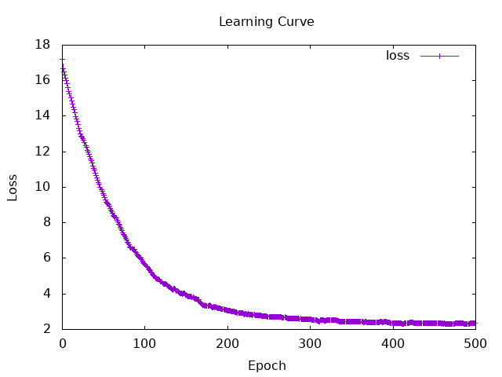
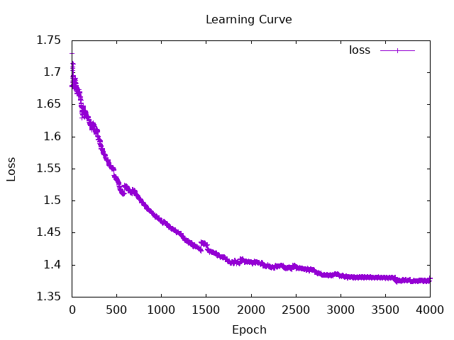
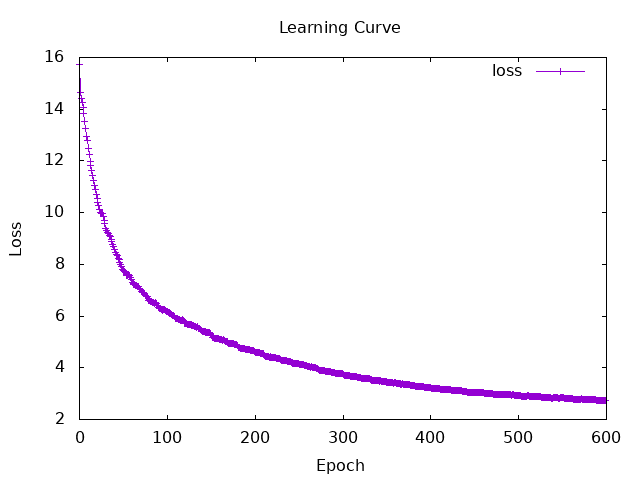
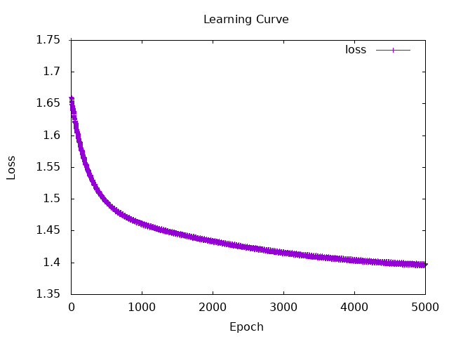

# Session 7
## Understanding the Concepts
### RNN (Recurrent Neural Network)
- It has a loop structure that passes past memories on to the next step by using hidden state.

- The formula for updating the hidden state : 
  $$ h_t = f(U x_t + W h_{t-1}) $$

- $h_t$ : current hidden state at time $t$
- $f$   : activation function (example: tanh or ReLU)
- $U$   : weight matrix for input $x_t$
- $x_t$ : input data at time $t$
- $W$ : weight matrix for the previous hidden state $h_{t-1}$
- $h_{t-1}$ : previous hidden state from time $t-1$

--pros
- It excels at handling time-series data such as text

--cons
- In longer texts, the influence of the words at the beginning diminishes

### LSTM (Long Short-Term Memory)
- It is an evolved version of an RNN that adds a long-term memory called a "Cell state" and three gates to control the flow of information in order to overcome the weaknesses of RNN.

- The Roles of the Three Types of Gates
    - Forget Gate : trush the unneccesary data from pass memories
    - Input Gate  : add memories worth remembering from new input data
    - Output Gate : decide output from current memory and new input

--pros
- It can remember long-term context of long text

--cons
- It takes more time to calculate because of complexity

## Hands-on tasks 
Build RNN model

### 1.a.  Load data
- load data, extract the necessary data for input and target, and change it to tensor  
    - input : **text**  of review  
    - target : **rating** of review


### 1.b. 
- **MSE**   
numIters = 500   
learnRate = 0.002    
wordDimension = 64  
batchSize = 32   
dataSize = 1000   --train_dataとして使うreview数   
rnnHiddenDim = 64  -- RNNの記憶のサイズ   

```
Iteration: 50 | Loss_valid: Tensor Float []  9.6601   | Loss_train: Tensor Float []  9.6067   
Iteration: 100 | Loss_valid: Tensor Float []  5.7080   | Loss_train: Tensor Float []  3.6949   
Iteration: 150 | Loss_valid: Tensor Float []  3.9649   | Loss_train: Tensor Float []  2.3210   
Iteration: 200 | Loss_valid: Tensor Float []  3.0788   | Loss_train: Tensor Float []  2.6110   
Iteration: 250 | Loss_valid: Tensor Float []  2.7243   | Loss_train: Tensor Float []  2.3947   
Iteration: 300 | Loss_valid: Tensor Float []  2.5951   | Loss_train: Tensor Float []  2.0967   
Iteration: 350 | Loss_valid: Tensor Float []  2.4387   | Loss_train: Tensor Float []  2.5051   
Iteration: 400 | Loss_valid: Tensor Float []  2.3509   | Loss_train: Tensor Float []  2.7025   
Iteration: 450 | Loss_valid: Tensor Float []  2.3627   | Loss_train: Tensor Float []  1.0406   
Iteration: 500 | Loss_valid: Tensor Float []  2.3465   | Loss_train: Tensor Float []  1.1358   

=== Final Evaluation ===
Accuracy: 19.2%
Confusion Matrix (Row: True, Col: Pred):
[0,0,4,16,1]
[0,0,1,3,0]
[0,0,6,11,0]
[0,2,3,15,0]
[0,2,16,42,3]

=== Final scores ===
[4.4475446,3.5932465,3.4893017,3.9165716,3.9936657,4.640474,3.0588965,3.6666794,3.9235187,3.5473108,3.8531342,4.2950783,2.558897,3.539717,3.6235363,4.1395617,3.8652763,2.560337,2.4429379,4.633754,3.7013736,2.5846357,3.8059473,4.447579,3.4583406,2.0588853,3.0526595,2.6115935,2.831072,4.0514426,4.0921216,3.785039,3.5120652,3.3645687,3.7999768,3.5853639,3.8693986,3.906609,4.4717245,3.9232779,3.558968,3.5120652,4.005385,4.289911,3.3892746,3.5120652,4.212356,3.4058442,3.5317926,3.4316492,3.67623,3.7024708,3.958807,3.8926425,4.306303,3.582899,4.1644707,4.2957487,4.3487067,3.9559932,3.8315582,4.06858,3.8484402,4.4475446,3.63812,4.4845743,2.8171735,2.8171735,3.3520474,4.0839853,3.6620078,3.2665162,3.7277555,3.7557478,1.9700509,4.2212677,3.8162117,4.375745,3.838129,3.9273596,3.8026772,4.2710867,3.4058442,3.4058442,3.172213,3.5488286,3.6844935,3.0934634,3.8228536,1.9609363,3.3104017,3.8021727,3.338749,3.8787284,3.4079075,3.9559917,3.369924,3.6718745,3.8032532,4.4108543,3.9918003,3.6261795,3.6069198,4.0036044,3.7277555,3.8162117,3.1348734,3.7919793,3.7297215,3.3561072,3.2061534,4.1237707,3.8706498,4.0952334,4.363961,3.2220135,4.572628,3.2779663,4.0220594,4.1826158,3.5716376,4.4646077,3.80169,4.6404734,4.286169]
```
  

my-analysis :   
Most of the values were close to 3 or 4.   
This is likely because the mean squared error was used as the loss function.    

---
#### result of 5 times run (mse)
average of accuracy : **17.6%**
<details>
<summary>Terminal Output of 5 times (Click to view)</summary>

```
=== Final Evaluation ===
Accuracy: 19.2%
Confusion Matrix (Row: True, Col: Pred):
[0,0,4,16,1]
[0,0,1,3,0]
[0,0,6,11,0]
[0,2,3,15,0]
[0,2,16,42,3]

=== Final Evaluation ===
Accuracy: 20.0%
Confusion Matrix (Row: True, Col: Pred):
[0,0,6,15,0]
[0,0,1,3,0]
[0,0,8,9,0]
[0,2,5,13,0]
[0,0,25,34,4]

=== Final Evaluation ===
Accuracy: 16.8%
Confusion Matrix (Row: True, Col: Pred):
[0,0,3,18,0]
[0,0,2,2,0]
[0,0,6,10,1]
[0,0,5,14,1]
[0,0,13,49,1]

=== Final Evaluation ===
Accuracy: 12.8%
Confusion Matrix (Row: True, Col: Pred):
[0,0,11,9,1]
[0,0,2,2,0]
[0,1,5,11,0]
[0,0,9,9,2]
[0,2,20,39,2]

=== Final Evaluation ===
Accuracy: 19.2%
Confusion Matrix (Row: True, Col: Pred):
[0,0,6,15,0]
[0,0,1,3,0]
[0,0,4,12,1]
[0,0,3,17,0]
[0,1,17,42,3]
```

</details>

---
- **NllLoss**  
numIters = 4000   
learnRate = 0.002    
wordDimension = 64  
batchSize = 32   
dataSize = 1000  
rnnHiddenDim = 64   

```
=== Final Evaluation ===
Accuracy: 49.6%
Confusion Matrix (Row: True, Col: Pred):
[1,0,1,1,18]
[0,1,0,0,3]
[0,3,0,3,11]
[0,0,0,0,20]
[0,1,0,2,60]
```
  

- almost all predicted rating value was 5
- It is because the reviews that has 5 rating is many 

<details>
<summary>Terminal Output (Click to view)</summary>

```
Iteration: 100 | Loss_valid: Tensor Float []  1.6573   | Loss_train: Tensor Float []  1.6309   
Iteration: 200 | Loss_valid: Tensor Float []  1.6199   | Loss_train: Tensor Float []  1.6440   
Iteration: 300 | Loss_valid: Tensor Float []  1.5965   | Loss_train: Tensor Float []  1.5794   
Iteration: 400 | Loss_valid: Tensor Float []  1.5634   | Loss_train: Tensor Float []  1.5812   
Iteration: 500 | Loss_valid: Tensor Float []  1.5339   | Loss_train: Tensor Float []  1.4483   
Iteration: 600 | Loss_valid: Tensor Float []  1.5220   | Loss_train: Tensor Float []  1.6961   
Iteration: 700 | Loss_valid: Tensor Float []  1.5161   | Loss_train: Tensor Float []  1.5889   
Iteration: 800 | Loss_valid: Tensor Float []  1.4957   | Loss_train: Tensor Float []  1.4704   
Iteration: 900 | Loss_valid: Tensor Float []  1.4802   | Loss_train: Tensor Float []  1.3790   
Iteration: 1000 | Loss_valid: Tensor Float []  1.4684   | Loss_train: Tensor Float []  1.4580   
Iteration: 1100 | Loss_valid: Tensor Float []  1.4587   | Loss_train: Tensor Float []  1.5226   
Iteration: 1200 | Loss_valid: Tensor Float []  1.4491   | Loss_train: Tensor Float []  1.3272   
Iteration: 1300 | Loss_valid: Tensor Float []  1.4387   | Loss_train: Tensor Float []  1.4509   
Iteration: 1400 | Loss_valid: Tensor Float []  1.4282   | Loss_train: Tensor Float []  1.2348   
Iteration: 1500 | Loss_valid: Tensor Float []  1.4312   | Loss_train: Tensor Float []  1.4639   
Iteration: 1600 | Loss_valid: Tensor Float []  1.4188   | Loss_train: Tensor Float []  1.3846   
Iteration: 1700 | Loss_valid: Tensor Float []  1.4133   | Loss_train: Tensor Float []  1.2301   
Iteration: 1800 | Loss_valid: Tensor Float []  1.4036   | Loss_train: Tensor Float []  1.3088   
Iteration: 1900 | Loss_valid: Tensor Float []  1.4081   | Loss_train: Tensor Float []  1.3227   
Iteration: 2000 | Loss_valid: Tensor Float []  1.4051   | Loss_train: Tensor Float []  1.7298   
Iteration: 2100 | Loss_valid: Tensor Float []  1.4023   | Loss_train: Tensor Float []  1.4129   
Iteration: 2200 | Loss_valid: Tensor Float []  1.3979   | Loss_train: Tensor Float []  0.9205   
Iteration: 2300 | Loss_valid: Tensor Float []  1.3983   | Loss_train: Tensor Float []  1.5380   
Iteration: 2400 | Loss_valid: Tensor Float []  1.3946   | Loss_train: Tensor Float []  1.1550   
Iteration: 2500 | Loss_valid: Tensor Float []  1.3979   | Loss_train: Tensor Float []  1.5669   
Iteration: 2600 | Loss_valid: Tensor Float []  1.3943   | Loss_train: Tensor Float []  1.5990   
Iteration: 2700 | Loss_valid: Tensor Float []  1.3933   | Loss_train: Tensor Float []  1.0679   
Iteration: 2800 | Loss_valid: Tensor Float []  1.3845   | Loss_train: Tensor Float []  1.2047   
Iteration: 2900 | Loss_valid: Tensor Float []  1.3840   | Loss_train: Tensor Float []  1.1953   
Iteration: 3000 | Loss_valid: Tensor Float []  1.3836   | Loss_train: Tensor Float []  1.3544   
Iteration: 3100 | Loss_valid: Tensor Float []  1.3812   | Loss_train: Tensor Float []  1.3013   
Iteration: 3200 | Loss_valid: Tensor Float []  1.3801   | Loss_train: Tensor Float []  1.5476   
Iteration: 3300 | Loss_valid: Tensor Float []  1.3816   | Loss_train: Tensor Float []  1.6821   
Iteration: 3400 | Loss_valid: Tensor Float []  1.3806   | Loss_train: Tensor Float []  1.1974   
Iteration: 3500 | Loss_valid: Tensor Float []  1.3795   | Loss_train: Tensor Float []  1.3336   
Iteration: 3600 | Loss_valid: Tensor Float []  1.3802   | Loss_train: Tensor Float []  1.3736   
Iteration: 3700 | Loss_valid: Tensor Float []  1.3767   | Loss_train: Tensor Float []  1.2640   
Iteration: 3800 | Loss_valid: Tensor Float []  1.3741   | Loss_train: Tensor Float []  1.4033   
Iteration: 3900 | Loss_valid: Tensor Float []  1.3760   | Loss_train: Tensor Float []  1.2491   
Iteration: 4000 | Loss_valid: Tensor Float []  1.3786   | Loss_train: Tensor Float []  1.3021   

=== Final Evaluation ===
Accuracy: 49.6%
Confusion Matrix (Row: True, Col: Pred):
[1,0,1,1,18]
[0,1,0,0,3]
[0,3,0,3,11]
[0,0,0,0,20]
[0,1,0,2,60]
Tensor Float [125,5] [[-2.0500   , -2.2531   , -2.7368   , -2.0422   , -0.5592   ],
                      [-1.9678   , -2.7443   , -2.6099   , -2.2365   , -0.4852   ],
                      [-2.3526   , -3.2817   , -2.7746   , -2.4087   , -0.3355   ],
                      [-1.7246   , -2.3781   , -2.0316   , -1.5622   , -0.9461   ],
                      [-2.1250   , -2.2223   , -2.1330   , -1.8364   , -0.7045   ],
                      [-2.1332   , -2.1080   , -1.7453   , -2.2372   , -0.7367   ],
                      [-2.1525   , -2.8805   , -2.2054   , -1.4547   , -0.7256   ],
                      [-2.0264   , -1.4730   , -2.0345   , -2.0438   , -0.9711   ],
                      [-2.3497   , -1.2162   , -1.7112   , -1.5533   , -1.5323   ],
                      [-2.2127   , -2.4204   , -2.1143   , -1.5701   , -0.7487   ],
                      [-1.7559   , -2.0298   , -2.2092   , -1.1377   , -1.3260   ],
                      [-2.0180   , -2.9211   , -2.2119   , -1.8904   , -0.5930   ],
                      [-2.3244   , -3.0897   , -2.5386   , -1.9482   , -0.4539   ],
                      [-1.7095   , -1.5888   , -1.2363   , -1.8891   , -1.7533   ],
                      [-1.8024   , -2.0817   , -2.2140   , -1.2376   , -1.1679   ],
                      [-1.8184   , -2.1834   , -2.4043   , -1.9086   , -0.7207   ],
                      [-1.8024   , -2.0817   , -2.2140   , -1.2376   , -1.1679   ],
                      [-1.9094   , -1.9067   , -2.0034   , -2.0077   , -0.8345   ],
                      [-2.1488   , -2.3229   , -1.7703   , -1.6092   , -0.8793   ],
                      [-2.2412   , -2.0785   , -2.0655   , -1.6785   , -0.7871   ],
                      [-1.9496   , -1.7071   , -1.5088   , -1.4544   , -1.5070   ],
                      [-2.1273   , -1.9461   , -2.1196   , -1.5160   , -0.9205   ],
                      [-2.4049   , -3.3528   , -3.0204   , -1.9183   , -0.3870   ],
                      [-1.9908   , -2.2325   , -2.1754   , -2.3284   , -0.6067   ],
                      [-2.2475   , -2.3916   , -2.5294   , -1.9238   , -0.5497   ],
                      [-1.7558   , -1.8027   , -1.9261   , -1.8827   , -1.0093   ],
                      [-2.1818   , -3.5058   , -2.9584   , -1.5502   , -0.5225   ],
                      [-1.8633   , -2.3667   , -1.7481   , -1.5847   , -0.9890   ],
                      [-2.0175   , -2.4266   , -2.1334   , -1.7924   , -0.7059   ],
                      [-2.2005   , -2.5314   , -1.7940   , -1.6286   , -0.8047   ],
                      [-1.7173   , -2.6150   , -2.2459   , -1.3845   , -0.9391   ],
                      [-1.7578   , -2.4610   , -2.4934   , -1.3158   , -0.9382   ],
                      [-1.8024   , -2.0817   , -2.2140   , -1.2376   , -1.1679   ],
                      [-2.0535   , -2.6591   , -2.5299   , -1.0516   , -0.9871   ],
                      [-1.9609   , -2.5329   , -2.4660   , -1.9472   , -0.5938   ],
                      [-1.8024   , -2.0817   , -2.2140   , -1.2376   , -1.1679   ],
                      [-2.1180   , -2.2600   , -1.9458   , -1.2630   , -1.0507   ],
                      [-1.6529   , -1.9337   , -2.1840   , -1.7373   , -0.9800   ],
                      [-1.7172   , -1.6770   , -2.0863   , -1.9635   , -0.9970   ],
                      [-2.2221   , -2.3490   , -1.7792   , -1.2890   , -1.0446   ],
                      [-1.8024   , -2.0817   , -2.2140   , -1.2376   , -1.1679   ],
                      [-1.8024   , -2.0817   , -2.2140   , -1.2376   , -1.1679   ],
                      [-2.2878   , -1.9159   , -1.6281   , -2.1044   , -0.8368   ],
                      [-1.8468   , -1.9525   , -2.0045   , -1.4066   , -1.1374   ],
                      [-1.9848   , -2.7016   , -2.1370   , -1.4630   , -0.8075   ],
                      [-1.8024   , -2.0817   , -2.2140   , -1.2376   , -1.1679   ],
                      [-2.3871   , -2.3259   , -2.0984   , -1.8024   , -0.6484   ],
                      [-2.0800   , -0.9209   , -1.3368   , -2.1941   , -2.2753   ],
                      [-2.4294   , -3.0863   , -2.7944   , -2.1120   , -0.3797   ],
                      [-1.9500   , -2.5800   , -2.2063   , -1.9501   , -0.6357   ],
                      [-1.8752   , -2.1529   , -1.7139   , -1.9452   , -0.8979   ],
                      [-2.2723   , -1.8691   , -1.8736   , -1.5387   , -0.9823   ],
                      [-1.5770   , -2.0792   , -2.3306   , -1.4562   , -1.0846   ],
                      [-2.0643   , -2.4884   , -2.5507   , -2.1879   , -0.5110   ],
                      [-2.0063   , -2.8955   , -2.2680   , -1.9306   , -0.5768   ],
                      [-2.2121   , -2.9236   , -2.9632   , -1.8954   , -0.4543   ],
                      [-2.2519   , -2.4575   , -2.0077   , -1.6215   , -0.7397   ],
                      [-2.0282   , -2.6344   , -2.4475   , -1.5706   , -0.6887   ],
                      [-1.8029   , -1.7330   , -1.7879   , -1.3851   , -1.4238   ],
                      [-1.8024   , -2.0817   , -2.2140   , -1.2376   , -1.1679   ],
                      [-1.8577   , -2.0213   , -1.3883   , -2.0514   , -1.0983   ],
                      [-2.0502   , -2.7943   , -2.1369   , -1.3932   , -0.8123   ],
                      [-1.7117   , -2.3755   , -2.5189   , -1.9043   , -0.6992   ],
                      [-1.9958   , -1.9410   , -2.0968   , -1.9783   , -0.7779   ],
                      [-2.0865   , -2.4778   , -2.5109   , -2.1535   , -0.5197   ],
                      [-2.2453   , -2.7164   , -2.2158   , -1.7136   , -0.6186   ],
                      [-2.0981   , -1.4733   , -1.8975   , -1.7069   , -1.1496   ],
                      [-2.0981   , -1.4733   , -1.8975   , -1.7069   , -1.1496   ],
                      [-1.8057   , -1.5996   , -1.7608   , -1.6659   , -1.2992   ],
                      [-2.1125   , -2.7879   , -2.7035   , -2.2886   , -0.4321   ],
                      [-1.8024   , -2.0817   , -2.2140   , -1.2376   , -1.1679   ],
                      [-2.2744   , -2.4416   , -1.8834   , -1.1241   , -1.0993   ],
                      [-1.8024   , -2.0817   , -2.2140   , -1.2376   , -1.1679   ],
                      [-2.1329   , -2.0700   , -2.1158   , -1.8535   , -0.7379   ],
                      [-1.6857   , -1.7393   , -1.6349   , -1.9889   , -1.1801   ],
                      [-1.3380   , -1.6102   , -1.6706   , -1.9296   , -1.5874   ],
                      [-1.8024   , -2.0817   , -2.2140   , -1.2376   , -1.1679   ],
                      [-2.0067   , -2.7535   , -2.4842   , -1.2071   , -0.8689   ],
                      [-2.1988   , -2.8792   , -2.6708   , -1.6106   , -0.5728   ],
                      [-2.2850   , -1.6618   , -1.8550   , -1.5325   , -1.0908   ],
                      [-2.3070   , -1.6690   , -1.8219   , -1.7635   , -0.9706   ],
                      [-1.9433   , -2.7114   , -2.3465   , -0.9577   , -1.1685   ],
                      [-2.0800   , -0.9209   , -1.3368   , -2.1941   , -2.2753   ],
                      [-2.0800   , -0.9209   , -1.3368   , -2.1941   , -2.2753   ],
                      [-2.2755   , -3.0481   , -2.8159   , -1.8987   , -0.4460   ],
                      [-1.6685   , -1.4421   , -1.7902   , -1.5879   , -1.5908   ],
                      [-2.0385   , -2.7572   , -2.6174   , -1.5635   , -0.6464   ],
                      [-1.9946   , -2.1665   , -2.2526   , -2.0338   , -0.6667   ],
                      [-2.0381   , -1.4732   , -1.7314   , -1.7914   , -1.2149   ],
                      [-1.9424   , -2.4124   , -2.2138   , -1.4294   , -0.8716   ],
                      [-1.5194   , -1.6122   , -1.7862   , -2.0269   , -1.2645   ],
                      [-1.9863   , -2.5143   , -2.1683   , -1.7144   , -0.7186   ],
                      [-2.5111   , -2.3708   , -1.7671   , -1.7069   , -0.7483   ],
                      [-2.2762   , -3.6576   , -2.7644   , -1.7049   , -0.4673   ],
                      [-2.1137   , -2.6967   , -2.6423   , -1.9616   , -0.5109   ],
                      [-1.9796   , -2.2809   , -2.7854   , -1.5661   , -0.7151   ],
                      [-1.8964   , -2.0857   , -1.9911   , -1.7138   , -0.8942   ],
                      [-2.1580   , -2.2271   , -2.3139   , -1.7213   , -0.6954   ],
                      [-2.4495   , -3.2899   , -2.8822   , -1.9718   , -0.3839   ],
                      [-2.5655   , -3.3704   , -3.0608   , -2.2403   , -0.3072   ],
                      [-2.0398   , -2.8658   , -2.1377   , -1.5864   , -0.7125   ],
                      [-1.8646   , -2.4270   , -2.3226   , -1.1207   , -1.1006   ],
                      [-2.1489   , -1.9165   , -1.8970   , -1.3007   , -1.1587   ],
                      [-2.0089   , -2.0878   , -2.4060   , -1.5514   , -0.8215   ],
                      [-1.8024   , -2.0817   , -2.2140   , -1.2376   , -1.1679   ],
                      [-1.8024   , -2.0817   , -2.2140   , -1.2376   , -1.1679   ],
                      [-1.8529   , -2.9590   , -2.7447   , -1.8550   , -0.5610   ],
                      [-1.7080   , -1.6228   , -1.8172   , -1.7595   , -1.2490   ],
                      [-1.7943   , -2.0825   , -2.2556   , -1.8309   , -0.8118   ],
                      [-1.8956   , -1.7698   , -1.9852   , -1.8975   , -0.9362   ],
                      [-2.1191   , -1.9355   , -1.8363   , -1.6473   , -0.9583   ],
                      [-1.8284   , -2.0538   , -2.1700   , -1.0922   , -1.3416   ],
                      [-1.8024   , -2.0817   , -2.2140   , -1.2376   , -1.1679   ],
                      [-1.8635   , -1.6550   , -2.0647   , -1.3877   , -1.2828   ],
                      [-2.1347   , -2.3288   , -2.2664   , -2.0822   , -0.5870   ],
                      [-1.7733   , -1.6311   , -2.0652   , -1.7013   , -1.1231   ],
                      [-2.0063   , -2.8955   , -2.2680   , -1.9306   , -0.5768   ],
                      [-1.8680   , -2.1476   , -1.6076   , -2.0638   , -0.9126   ],
                      [-2.0628   , -1.9309   , -1.5643   , -1.5097   , -1.2118   ],
                      [-1.8196   , -2.8306   , -2.5218   , -1.2991   , -0.8537   ],
                      [-2.2427   , -1.8114   , -1.7310   , -1.2512   , -1.3199   ],
                      [-1.4853   , -2.2640   , -2.3647   , -1.5912   , -0.9889   ],
                      [-2.2072   , -3.1478   , -2.8289   , -2.2778   , -0.3777   ],
                      [-2.1332   , -2.1080   , -1.7453   , -2.2372   , -0.7367   ],
                      [-1.9337   , -2.5060   , -2.3167   , -2.3985   , -0.5373   ]]
```
</details>

### 1.c.
numIters = 600   
learnRate = 0.002    
wordDimension = 64    
batchSize = 32    
dataSize = 1000  --train_dataとして使うreview数   
rnnHiddenDim = 64  -- RNNの記憶のサイズ   
```
Iteration: 50 | Loss_valid: Tensor Float []  7.5164   | Loss_train: Tensor Float []  5.6366   
Iteration: 100 | Loss_valid: Tensor Float []  5.6501   | Loss_train: Tensor Float []  2.9102   
Iteration: 150 | Loss_valid: Tensor Float []  5.0053   | Loss_train: Tensor Float []  3.8566   
Iteration: 200 | Loss_valid: Tensor Float []  4.6158   | Loss_train: Tensor Float []  5.3954   
Iteration: 250 | Loss_valid: Tensor Float []  4.2187   | Loss_train: Tensor Float []  2.5079   
Iteration: 300 | Loss_valid: Tensor Float []  3.9758   | Loss_train: Tensor Float []  2.7042   
Iteration: 350 | Loss_valid: Tensor Float []  3.7298   | Loss_train: Tensor Float []  3.3607   
Iteration: 400 | Loss_valid: Tensor Float []  3.4739   | Loss_train: Tensor Float []  3.1664   
Iteration: 450 | Loss_valid: Tensor Float []  3.3474   | Loss_train: Tensor Float []  1.0822   
Iteration: 500 | Loss_valid: Tensor Float []  3.1961   | Loss_train: Tensor Float []  1.2430   
Iteration: 550 | Loss_valid: Tensor Float []  3.0338   | Loss_train: Tensor Float []  2.3111   
Iteration: 600 | Loss_valid: Tensor Float []  2.9506   | Loss_train: Tensor Float []  1.4078   

=== Final Evaluation ===
Accuracy: 9.6%
Confusion Matrix (Row: True, Col: Pred):
[0,6,6,9,0]
[0,1,1,2,0]
[0,1,4,12,0]
[0,5,8,7,0]
[1,5,15,42,0]

=== Final scores ===
[3.65075,4.0199347,4.4667635,3.9777212,3.5437045,3.5261507,4.407822,2.9350772,3.170957,3.882451,2.0551841,3.2670064,4.030654,3.3536325,2.0551841,3.5019414,2.0551841,4.188711,2.8163047,2.9350772,4.1152854,3.9777212,3.7483358,2.779795,3.8721554,3.6425369,4.0911627,2.6117578,4.2656627,3.61766,2.7690775,3.0583863,2.0551841,4.145399,4.2173996,2.0551841,2.953653,3.8890297,4.148223,4.3931155,2.0551841,2.0551841,2.9350772,3.9490316,2.5722284,2.0551841,2.779795,2.9350772,3.5261507,3.6425369,3.6425369,4.0211105,2.953653,3.5551417,3.2670064,3.8923001,4.407822,3.5437045,4.0463696,2.0551841,4.0688686,4.3596063,4.028771,3.65075,3.5551417,3.7936916,2.9350772,2.9350772,2.9350772,3.5019414,2.0551841,4.077321,2.0551841,3.9777212,2.9350772,4.081319,2.0551841,4.2173996,4.343878,2.953653,3.5638108,3.2199852,2.9350772,2.9350772,3.7211974,4.2823954,4.1746597,3.7834003,2.9350772,4.3554997,3.9777212,4.263803,3.6350403,4.0317535,3.8923001,4.028771,3.1858854,1.3569028,2.9322798,2.9322798,3.7354286,3.8261948,3.9153671,2.9350772,2.0551841,2.0551841,3.5437045,4.2055445,3.5551417,3.65075,3.36251,2.953653,2.0551841,3.1595676,4.2173996,2.4176016,3.2670064,2.3287246,3.8923001,2.4152894,3.5437045,3.6494317,3.5019414,3.5261507,3.8923001]
```
  

result :   
- Most of the values were close to 3 or 4 when using previous parameters.   
- This is likely because the mean squared error was used as the loss function and average of data rating was 3~4.  
- And accuracy is lower than `1.b`. 
- The graph went down slowly than `1.b`.

---
#### result of 5 times run (mse)
average of accuracy : **11.04%**
<details>
<summary>Terminal Output of 5 times (Click to view)</summary>

```
=== Final Evaluation ===
Accuracy: 9.6%
Confusion Matrix (Row: True, Col: Pred):
[0,6,6,9,0]
[0,1,1,2,0]
[0,1,4,12,0]
[0,5,8,7,0]
[1,5,15,42,0]

=== Final Evaluation ===
Accuracy: 11.200001%
Confusion Matrix (Row: True, Col: Pred):
[0,1,8,12,0]
[0,0,3,1,0]
[0,0,5,11,1]
[0,3,8,9,0]
[0,5,15,43,0]

=== Final Evaluation ===
Accuracy: 9.6%
Confusion Matrix (Row: True, Col: Pred):
[0,0,12,9,0]
[0,0,3,1,0]
[0,0,5,12,0]
[0,4,9,7,0]
[0,3,23,37,0]

=== Final Evaluation ===
Accuracy: 15.2%
Confusion Matrix (Row: True, Col: Pred):
[0,3,6,12,0]
[0,1,2,1,0]
[0,0,5,12,0]
[0,2,5,13,0]
[0,4,23,36,0]

=== Final Evaluation ===
Accuracy: 9.6%
Confusion Matrix (Row: True, Col: Pred):
[0,0,10,11,0]
[0,0,3,1,0]
[0,0,6,10,1]
[0,1,14,5,0]
[0,3,16,43,1]
```
</details>


---
- **NllLoss**  
numIters = 5000   
learnRate = 0.002    
wordDimension = 64  
batchSize = 32   
dataSize = 1000  
rnnHiddenDim = 64   

```
=== Final Evaluation ===
Accuracy: 46.399998%
Confusion Matrix (Row: True, Col: Pred):
[0,2,0,0,19]
[0,1,0,0,3]
[0,3,0,0,14]
[0,1,0,0,19]
[0,6,0,0,57]
```
  

- almost all predicted rating value was 5
- It is because the reviews that has 5 rating is many 

<details>
<summary>Terminal Output (Click to view)</summary>

```
=== Final Evaluation ===
Accuracy: 46.399998%
Confusion Matrix (Row: True, Col: Pred):
[0,2,0,0,19]
[0,1,0,0,3]
[0,3,0,0,14]
[0,1,0,0,19]
[0,6,0,0,57]
Tensor Float [125,5] [[-1.9227   , -2.5035   , -2.1463   , -1.4593   , -0.8611   ],
                      [-1.8723   , -3.1035   , -2.3460   , -1.4672   , -0.7444   ],
                      [-2.0929   , -2.4605   , -2.1582   , -1.7860   , -0.6770   ],
                      [-2.2292   , -2.6458   , -2.2804   , -2.0389   , -0.5293   ],
                      [-2.2654   , -2.6030   , -2.1930   , -1.7433   , -0.6243   ],
                      [-2.0394   , -2.6896   , -1.9945   , -1.6920   , -0.7303   ],
                      [-2.1195   , -3.3056   , -2.7307   , -1.5364   , -0.5746   ],
                      [-2.4073   , -0.9260   , -1.6043   , -2.3266   , -1.5364   ],
                      [-2.4073   , -0.9260   , -1.6043   , -2.3266   , -1.5363   ],
                      [-1.7678   , -2.7513   , -2.0795   , -1.6978   , -0.7823   ],
                      [-1.8116   , -2.0503   , -2.2835   , -1.2671   , -1.1260   ],
                      [-1.7826   , -2.0469   , -1.7777   , -1.5099   , -1.1625   ],
                      [-2.3728   , -2.7450   , -2.2171   , -1.8411   , -0.5535   ],
                      [-2.1805   , -2.6554   , -2.2790   , -1.4767   , -0.7216   ],
                      [-1.8116   , -2.0503   , -2.2835   , -1.2671   , -1.1260   ],
                      [-2.0469   , -2.2002   , -2.0803   , -1.6993   , -0.7933   ],
                      [-1.8116   , -2.0503   , -2.2835   , -1.2671   , -1.1260   ],
                      [-1.9878   , -3.2746   , -2.8187   , -1.5565   , -0.5895   ],
                      [-2.1533   , -1.8966   , -1.9777   , -1.7561   , -0.8611   ],
                      [-2.4073   , -0.9260   , -1.6043   , -2.3266   , -1.5364   ],
                      [-1.9992   , -2.4477   , -2.4061   , -1.4465   , -0.7930   ],
                      [-1.9615   , -2.7643   , -2.3604   , -1.5500   , -0.7140   ],
                      [-2.2145   , -2.2042   , -1.6209   , -1.9687   , -0.8140   ],
                      [-2.0130   , -2.1350   , -1.9001   , -1.8144   , -0.8309   ],
                      [-2.0698   , -2.6076   , -2.4093   , -1.6017   , -0.6760   ],
                      [-2.1028   , -1.9550   , -1.4846   , -1.9512   , -1.0007   ],
                      [-2.2145   , -2.2042   , -1.6209   , -1.9687   , -0.8140   ],
                      [-1.8436   , -2.3491   , -2.1516   , -1.3772   , -0.9736   ],
                      [-2.3144   , -2.7893   , -2.5078   , -1.7964   , -0.5236   ],
                      [-2.0719   , -2.4224   , -2.1307   , -1.8799   , -0.6655   ],
                      [-1.9536   , -2.3447   , -2.2402   , -1.5023   , -0.8363   ],
                      [-1.9832   , -1.7776   , -1.6565   , -1.7264   , -1.1252   ],
                      [-1.8116   , -2.0503   , -2.2835   , -1.2671   , -1.1260   ],
                      [-1.9486   , -2.1716   , -2.1481   , -1.4053   , -0.9635   ],
                      [-2.1092   , -3.3121   , -2.5110   , -1.6235   , -0.5730   ],
                      [-1.8116   , -2.0503   , -2.2835   , -1.2671   , -1.1260   ],
                      [-1.8670   , -2.0159   , -2.0402   , -1.3760   , -1.1098   ],
                      [-1.8048   , -2.3930   , -1.6452   , -1.5740   , -1.0672   ],
                      [-2.2438   , -2.9143   , -2.1517   , -2.0536   , -0.5190   ],
                      [-2.3816   , -2.3536   , -1.7720   , -2.2139   , -0.6286   ],
                      [-1.8116   , -2.0503   , -2.2835   , -1.2671   , -1.1260   ],
                      [-1.8116   , -2.0503   , -2.2835   , -1.2671   , -1.1260   ],
                      [-2.4073   , -0.9260   , -1.6043   , -2.3266   , -1.5364   ],
                      [-2.1196   , -2.4173   , -1.8085   , -1.6936   , -0.8142   ],
                      [-2.0991   , -1.8818   , -1.8271   , -1.4297   , -1.1244   ],
                      [-1.8116   , -2.0503   , -2.2835   , -1.2671   , -1.1260   ],
                      [-2.0426   , -1.9962   , -1.8792   , -1.9793   , -0.8129   ],
                      [-2.4073   , -0.9260   , -1.6043   , -2.3266   , -1.5364   ],
                      [-2.0394   , -2.6896   , -1.9945   , -1.6920   , -0.7303   ],
                      [-2.1795   , -2.6581   , -2.4006   , -1.6867   , -0.6143   ],
                      [-1.9781   , -2.8127   , -2.1560   , -1.6742   , -0.6964   ],
                      [-2.1565   , -2.7679   , -2.1953   , -1.9428   , -0.5677   ],
                      [-1.9903   , -1.8387   , -1.7124   , -1.5295   , -1.1801   ],
                      [-2.0469   , -2.2002   , -2.0803   , -1.6993   , -0.7933   ],
                      [-1.7826   , -2.0469   , -1.7777   , -1.5099   , -1.1625   ],
                      [-1.9398   , -2.9045   , -2.5399   , -1.4204   , -0.7319   ],
                      [-2.1195   , -3.3056   , -2.7307   , -1.5364   , -0.5746   ],
                      [-2.2654   , -2.6030   , -2.1930   , -1.7433   , -0.6243   ],
                      [-2.3398   , -2.6048   , -2.2748   , -1.7138   , -0.6038   ],
                      [-1.8116   , -2.0503   , -2.2835   , -1.2671   , -1.1260   ],
                      [-1.9893   , -2.6433   , -2.2935   , -1.3526   , -0.8379   ],
                      [-1.8779   , -2.7159   , -2.3758   , -1.6003   , -0.7212   ],
                      [-2.3206   , -2.4299   , -1.8900   , -2.0230   , -0.6341   ],
                      [-1.9227   , -2.5035   , -2.1463   , -1.4593   , -0.8611   ],
                      [-2.0469   , -2.2002   , -2.0803   , -1.6993   , -0.7933   ],
                      [-2.1309   , -2.2786   , -1.7594   , -1.3469   , -1.0594   ],
                      [-2.4073   , -0.9260   , -1.6043   , -2.3266   , -1.5364   ],
                      [-2.4073   , -0.9260   , -1.6043   , -2.3266   , -1.5364   ],
                      [-2.4073   , -0.9260   , -1.6043   , -2.3266   , -1.5364   ],
                      [-2.0469   , -2.2002   , -2.0803   , -1.6993   , -0.7933   ],
                      [-1.8116   , -2.0503   , -2.2835   , -1.2671   , -1.1260   ],
                      [-2.4912   , -2.8418   , -2.1834   , -2.2905   , -0.4385   ],
                      [-1.8116   , -2.0503   , -2.2835   , -1.2671   , -1.1260   ],
                      [-2.1263   , -2.5993   , -2.6341   , -1.6588   , -0.6083   ],
                      [-2.4073   , -0.9260   , -1.6043   , -2.3266   , -1.5364   ],
                      [-2.1799   , -2.3772   , -1.7194   , -1.7843   , -0.8051   ],
                      [-1.8116   , -2.0503   , -2.2835   , -1.2671   , -1.1260   ],
                      [-2.0506   , -2.4999   , -2.0225   , -1.6580   , -0.7627   ],
                      [-1.9866   , -2.5693   , -2.6781   , -1.5637   , -0.6769   ],
                      [-2.0633   , -1.9630   , -1.7792   , -1.6134   , -1.0091   ],
                      [-2.0467   , -2.8213   , -2.6760   , -1.3745   , -0.7144   ],
                      [-1.4894   , -2.4018   , -1.9459   , -1.5571   , -1.1076   ],
                      [-2.4073   , -0.9260   , -1.6043   , -2.3266   , -1.5364   ],
                      [-2.4073   , -0.9260   , -1.6043   , -2.3266   , -1.5364   ],
                      [-2.1734   , -2.5474   , -2.3272   , -1.6455   , -0.6589   ],
                      [-1.9519   , -3.0117   , -2.4459   , -1.5632   , -0.6681   ],
                      [-2.0789   , -2.5958   , -2.7088   , -1.3428   , -0.7495   ],
                      [-2.3569   , -2.1853   , -1.6237   , -1.9124   , -0.8031   ],
                      [-2.4073   , -0.9260   , -1.6043   , -2.3266   , -1.5364   ],
                      [-2.1263   , -2.5993   , -2.6341   , -1.6588   , -0.6083   ],
                      [-1.8362   , -2.7853   , -2.0560   , -1.4472   , -0.8779   ],
                      [-1.7939   , -2.4467   , -2.2805   , -1.6046   , -0.8121   ],
                      [-2.5642   , -2.8150   , -2.3327   , -1.9748   , -0.4663   ],
                      [-1.8363   , -2.5191   , -2.3067   , -1.3223   , -0.9315   ],
                      [-2.3036   , -2.9090   , -2.6599   , -1.6667   , -0.5332   ],
                      [-2.3493   , -2.5015   , -1.8139   , -2.1912   , -0.6018   ],
                      [-2.1298   , -2.2030   , -1.7391   , -1.6872   , -0.8917   ],
                      [-2.0111   , -2.2533   , -2.0542   , -1.3049   , -1.0169   ],
                      [-2.0561   , -2.8224   , -2.4966   , -1.6391   , -0.6235   ],
                      [-1.9259   , -2.2445   , -2.2897   , -1.2972   , -0.9844   ],
                      [-1.9870   , -2.4131   , -2.0109   , -1.9347   , -0.7032   ],
                      [-1.8656   , -2.3321   , -2.0453   , -1.5831   , -0.8833   ],
                      [-1.7513   , -2.6876   , -1.8889   , -1.3055   , -1.0902   ],
                      [-2.4073   , -0.9260   , -1.6043   , -2.3266   , -1.5364   ],
                      [-1.8116   , -2.0503   , -2.2835   , -1.2671   , -1.1260   ],
                      [-1.8116   , -2.0503   , -2.2835   , -1.2671   , -1.1260   ],
                      [-2.2654   , -2.6030   , -2.1930   , -1.7433   , -0.6243   ],
                      [-1.9636   , -2.0873   , -1.8055   , -1.3901   , -1.1327   ],
                      [-2.0469   , -2.2002   , -2.0803   , -1.6993   , -0.7933   ],
                      [-1.9227   , -2.5035   , -2.1463   , -1.4593   , -0.8611   ],
                      [-2.3116   , -2.1214   , -1.7386   , -1.8017   , -0.8204   ],
                      [-2.0428   , -2.3125   , -1.9962   , -1.4973   , -0.8874   ],
                      [-1.8116   , -2.0503   , -2.2835   , -1.2671   , -1.1260   ],
                      [-2.2403   , -2.2343   , -2.2312   , -1.6231   , -0.7302   ],
                      [-2.1092   , -3.3121   , -2.5110   , -1.6235   , -0.5730   ],
                      [-1.9854   , -2.7476   , -2.1089   , -1.7855   , -0.6743   ],
                      [-1.7826   , -2.0469   , -1.7777   , -1.5099   , -1.1625   ],
                      [-1.8372   , -1.8440   , -1.7218   , -1.5703   , -1.2180   ],
                      [-2.3036   , -2.9090   , -2.6599   , -1.6667   , -0.5332   ],
                      [-1.6821   , -2.3038   , -1.8734   , -1.7197   , -0.9639   ],
                      [-2.2654   , -2.6030   , -2.1930   , -1.7433   , -0.6243   ],
                      [-2.0310   , -2.8297   , -2.8069   , -1.4539   , -0.6622   ],
                      [-2.0469   , -2.2002   , -2.0803   , -1.6993   , -0.7933   ],
                      [-2.0394   , -2.6896   , -1.9945   , -1.6920   , -0.7303   ],
                      [-2.3036   , -2.9090   , -2.6599   , -1.6667   , -0.5332   ]]

```

</details>


### 1.d
learnRate = 0.002    
wordDimension = 64  
batchSize = 32   
dataSize = 1000  
rnnHiddenDim = 64   
activation function = tanh

| Initialization | Loss Function | Iterations | Accuracy (average of 5 times) |
| :--- | :--- | :--- | :--- |
| random | mse | 500 | 17.6% |
| pre-trained | mse | 600 | 11.04% |
| random | nllLoss | 4000 | 49.44% |
| pre-trained | nllLoss | 5000 | 46.56% |


- **random** vs **pre-trained** ?  
    - Random initialization has a higher accuracy rate...

    - Pre-trained parameter can be not good parameter?

- **mse** vs **nllLoss** ?  
    - If I just look accuracy, nllLoss is higher.  

    - When I use nllLoss, almost all review was predicted 5.   
    -> I think it is because there are frequent 5-rating reviews.  
    -> Using a dataset without bias may improve the results.

    - When I use mse, almost all review was predicted 3 or 4.   
    -> I think it is because average of rating was about 3~4.  

    - So both loss function was not worked well.