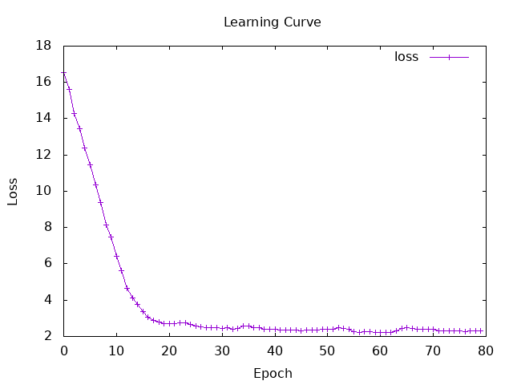
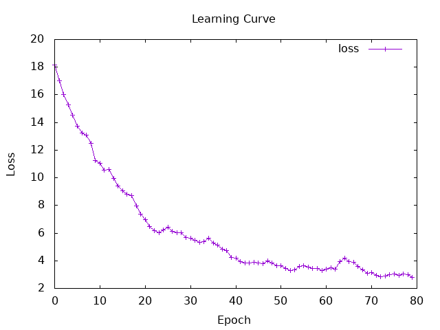

# Session8

**What I did:**
- Implemented LSTM 
- Compared results across different word dimensions
- Compared results across different `lstmHiddenDim` sizes

Reference for the LSTM implementation:
https://github.com/hasktorch/hasktorch/blob/16b7e3efdd7101f26987f5b88bbe3b150e5a08c8/examples/rnn/LSTM.hs

※ My LSTM code is in the session7 folder.

### LSTM (Long Short-Term Memory)
- It is an evolved version of an RNN that adds a long-term memory called a "Cell state" and three gates to control the flow of information in order to overcome the weaknesses of RNN.

- The Roles of the Three Types of Gates and cell state
    - Forget Gate $f_t$ : trush the unneccesary data from pass memories. 
        - $$f_t = \sigma(W_{if} x_t + W_{hf} h_{t-1} + b_f)$$

    - Input Gate  $i_t$ : add memories worth remembering from new input data. 
        - $$i_t = \sigma(W_{ii} x_t + W_{hi} h_{t-1} + b_i)$$

    - Candidate Cell State ($\tilde{c}_t$).   
        - $$\tilde{c}_t = \tanh(W_{ig} x_t + W_{hg} h_{t-1} + b_g)$$

    - Cell State Update $c_t$ : make Long-term memory. 
        - $$c_t = f_t \odot c_{t-1} + i_t \odot \tilde{c}_t$$

      -  $\odot$ : multiplication by elements

    - Output Gate $o_t$ : decide output from current memory and new input. 
        - $$o_t = \sigma(W_{io} x_t + W_{ho} h_{t-1} + b_o)$$

- Hidden State Update $h_t$. 
$$h_t = o_t \odot \tanh(c_t)$$


## result

numIters = 80  
learnRate = 0.01  
wordDimension = 256   
batchSize = 32  
dataSize = 1000    
lstmHiddenDim = 512  

```
finish initialize
finish load data
finish prepare data
Iteration: 10 | Loss_valid: Tensor Float []  7.4992    | Loss_train: Tensor Float []  10.3533   
Iteration: 20 | Loss_valid: Tensor Float []  2.7117    | Loss_train: Tensor Float []  2.5179   
Iteration: 30 | Loss_valid: Tensor Float []  2.4726    | Loss_train: Tensor Float []  2.7922   
Iteration: 40 | Loss_valid: Tensor Float []  2.4059    | Loss_train: Tensor Float []  2.1441   
Iteration: 50 | Loss_valid: Tensor Float []  2.4179    | Loss_train: Tensor Float []  1.2941   
Iteration: 60 | Loss_valid: Tensor Float []  2.2266    | Loss_train: Tensor Float []  2.0193   
Iteration: 70 | Loss_valid: Tensor Float []  2.3823    | Loss_train: Tensor Float []  2.2926   
Iteration: 80 | Loss_valid: Tensor Float []  2.3298    | Loss_train: Tensor Float []  0.8869   

=== Final Evaluation ===
Accuracy: 35.2%
Micro F1:    0.35341364
Macro F1:    0.22464415
Weighted F1: 0.34769934
Unknown Word Ratio: 5.7806325%
Confusion Matrix (Row: True, Col: Pred):
[0,0,5,10,6]
[0,0,1,2,1]
[0,0,8,8,1]
[0,0,3,9,7]
[0,0,9,27,27]
```
- It has slightly higher accuracy than RNN
- The loss decreases faster than with RNN.  
  RNN took a longer time to converge. Using the same parameters, the loss in RNN decreases to a certain extent after about 40 iterations, while in LSTM it decreases to a certain extent after about 20 iterations
- Using LSTM increased the computational load, making the process very slow. While an RNN takes about 10 seconds for 80 loops, an LSTM takes about 1 minute
- The computer tends to get hotter.

  


<details>
<summary>RNN result by using same parameter (Click to view)</summary>

```
Iteration: 10 | Loss_valid: Tensor Float []  11.2388   | Loss_train: Tensor Float []  13.9834   
Iteration: 20 | Loss_valid: Tensor Float []  7.3843   | Loss_train: Tensor Float []  7.4859   
Iteration: 30 | Loss_valid: Tensor Float []  5.6767   | Loss_train: Tensor Float []  6.2742   
Iteration: 40 | Loss_valid: Tensor Float []  4.2219   | Loss_train: Tensor Float []  3.1772   
Iteration: 50 | Loss_valid: Tensor Float []  3.6593   | Loss_train: Tensor Float []  2.9258   
Iteration: 60 | Loss_valid: Tensor Float []  3.2883   | Loss_train: Tensor Float []  2.7552   
Iteration: 70 | Loss_valid: Tensor Float []  3.0879   | Loss_train: Tensor Float []  2.1492   
Iteration: 80 | Loss_valid: Tensor Float []  2.8094   | Loss_train: Tensor Float []  1.5425   

=== Final Evaluation ===
Accuracy: 16.8%
Confusion Matrix (Row: True, Col: Pred):
[0,7,3,11,0]
[1,0,1,2,0]
[1,1,8,7,0]
[0,6,9,4,1]
[0,8,26,20,9]
```
  

</details>

## Comparing different wordDimension
numIters = 80  
learnRate = 0.01  
wordDimension = 256  
batchSize = 32  
dataSize = 1000   

| wordDimension | lstmHiddenDim | Accuracy | Micro F1 | Macro F1 | Weighted F1 |
| :---: | :---: | :---: | :---: | :---: | :---: |
| 64 | 512 | 0.2000 | 0.2000 | 0.1310 | 0.1507 |
| 128 | 512 | 0.2160 | 0.2160 | 0.1450 | 0.1789 |
| 256 | 512 | 0.2587 | 0.2587 | 0.1708 | 0.2365 |

## Comparing different `lstmHiddenDim`
numIters = 80  
learnRate = 0.01  
wordDimension = 256  
batchSize = 32  
dataSize = 1000   

| wordDimension | lstmHiddenDim | Accuracy | Micro F1 | Macro F1 | Weighted F1 |
| :---: | :---: | :---: | :---: | :---: | :---: |
| 256 | 128 | 0.1920 | 0.1920 | 0.1264 | 0.1305 |
| 256 | 256 | 0.1893 | 0.1893 | 0.1238 | 0.1605 |
| 256 | 512 | 0.2587 | 0.2587 | 0.1708 | 0.2365 |
