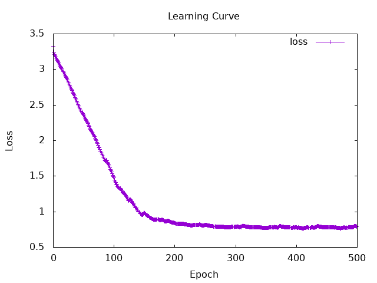
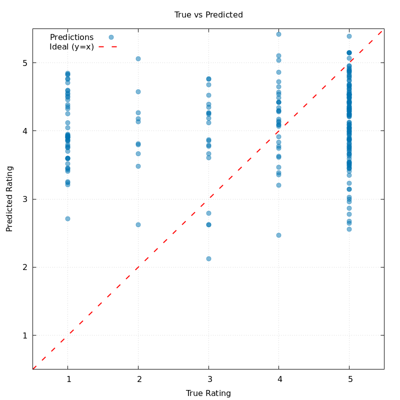
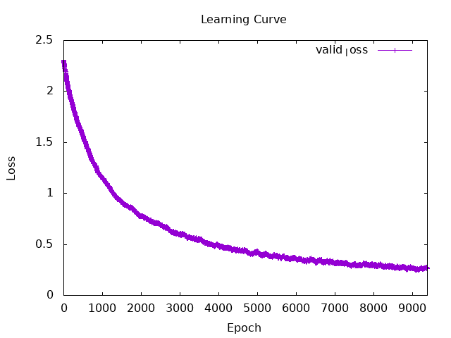

# Session9

**what I did :**
- LSTM
    - Modified LSTM model (but no performance change...)
    - Addition of evaluation metrics (MAE, RMSE, and Within ±1 accuracy)
    - plot the result
---
- image classification  
    - implementation of **mnist** classification   
    Reference for How to get dataset: https://zenn.dev/kumazo/articles/d635cca42727b7  
    Reference for the mnist classification implementation:
    ：https://github.com/hasktorch/hasktorch/tree/master/examples/mnist-mlp


## evaluation metrics
- MAE (Mean Absolute Error)
$$
\text{MAE} = \frac{1}{n} \sum_{i=1}^{n} |y_i - \hat{y}_i|
$$ 

- RMSE (Root Mean Squared Error)
$$
\text{RMSE} = \sqrt{\frac{1}{n} \sum_{i=1}^{n} (y_i - \hat{y}_i)^2}
$$


## result (LSTM)
loss function : Huber loss

```
numIters = 500
learnRate = asTensor (0.007 :: Float)
wordDimension = 256
batchSize = 32
dataSize = 2000
lstmHiddenDim = 512
```

```
finish initialize
finish load data
finish prepare data
Iteration: 10 | LR: 7.0e-3 | Loss_valid: Tensor Float []  3.0936    | Loss_train: Tensor Float []  3.5820   
Iteration: 20 | LR: 7.0e-3 | Loss_valid: Tensor Float []  2.9233    | Loss_train: Tensor Float []  2.8933   
Iteration: 30 | LR: 7.0e-3 | Loss_valid: Tensor Float []  2.7400    | Loss_train: Tensor Float []  3.0668   
Iteration: 40 | LR: 7.0e-3 | Loss_valid: Tensor Float []  2.5508    | Loss_train: Tensor Float []  3.2762   
Iteration: 50 | LR: 7.0e-3 | Loss_valid: Tensor Float []  2.3675    | Loss_train: Tensor Float []  2.5120   
Iteration: 60 | LR: 7.0e-3 | Loss_valid: Tensor Float []  2.1969    | Loss_train: Tensor Float []  2.3722   
Iteration: 70 | LR: 7.0e-3 | Loss_valid: Tensor Float []  2.0346    | Loss_train: Tensor Float []  2.1149   
Iteration: 80 | LR: 7.0e-3 | Loss_valid: Tensor Float []  1.8275    | Loss_train: Tensor Float []  1.9906   
Iteration: 90 | LR: 7.0e-3 | Loss_valid: Tensor Float []  1.6928    | Loss_train: Tensor Float []  1.3998   
Iteration: 100 | LR: 7.0e-3 | Loss_valid: Tensor Float []  1.4965    | Loss_train: Tensor Float []  1.3245   
Iteration: 110 | LR: 7.0e-3 | Loss_valid: Tensor Float []  1.3329    | Loss_train: Tensor Float []  1.1064   
Iteration: 120 | LR: 7.0e-3 | Loss_valid: Tensor Float []  1.2311    | Loss_train: Tensor Float []  1.3474   
Iteration: 130 | LR: 7.0e-3 | Loss_valid: Tensor Float []  1.1473    | Loss_train: Tensor Float []  1.2663   
Iteration: 140 | LR: 7.0e-3 | Loss_valid: Tensor Float []  1.0216    | Loss_train: Tensor Float []  1.0011   
Iteration: 150 | LR: 7.0e-3 | Loss_valid: Tensor Float []  0.9858    | Loss_train: Tensor Float []  0.7835   
Iteration: 160 | LR: 7.0e-3 | Loss_valid: Tensor Float []  0.9175    | Loss_train: Tensor Float []  1.0287   
Iteration: 170 | LR: 7.0e-3 | Loss_valid: Tensor Float []  0.8913    | Loss_train: Tensor Float []  1.1287   
Iteration: 180 | LR: 7.0e-3 | Loss_valid: Tensor Float []  0.8901    | Loss_train: Tensor Float []  1.1009   
Iteration: 190 | LR: 7.0e-3 | Loss_valid: Tensor Float []  0.8765    | Loss_train: Tensor Float []  1.0387   
Iteration: 200 | LR: 7.0e-3 | Loss_valid: Tensor Float []  0.8445    | Loss_train: Tensor Float []  0.6316   
Iteration: 210 | LR: 7.0e-3 | Loss_valid: Tensor Float []  0.8278    | Loss_train: Tensor Float []  1.4977   
Iteration: 220 | LR: 7.0e-3 | Loss_valid: Tensor Float []  0.8211    | Loss_train: Tensor Float []  0.6101   
Iteration: 230 | LR: 7.0e-3 | Loss_valid: Tensor Float []  0.8107    | Loss_train: Tensor Float []  0.8325   
Iteration: 240 | LR: 7.0e-3 | Loss_valid: Tensor Float []  0.8152    | Loss_train: Tensor Float []  1.3356   
Iteration: 250 | LR: 7.0e-3 | Loss_valid: Tensor Float []  0.8175    | Loss_train: Tensor Float []  1.0366   
Iteration: 260 | LR: 7.0e-3 | Loss_valid: Tensor Float []  0.8010    | Loss_train: Tensor Float []  1.1041   
Iteration: 270 | LR: 7.0e-3 | Loss_valid: Tensor Float []  0.7923    | Loss_train: Tensor Float []  0.9595   
Iteration: 280 | LR: 7.0e-3 | Loss_valid: Tensor Float []  0.7886    | Loss_train: Tensor Float []  0.6618   
Iteration: 290 | LR: 7.0e-3 | Loss_valid: Tensor Float []  0.7779    | Loss_train: Tensor Float []  0.5265   
Iteration: 300 | LR: 7.0e-3 | Loss_valid: Tensor Float []  0.7868    | Loss_train: Tensor Float []  1.0328   
Iteration: 310 | LR: 7.0e-3 | Loss_valid: Tensor Float []  0.7856    | Loss_train: Tensor Float []  0.9993   
Iteration: 320 | LR: 7.0e-3 | Loss_valid: Tensor Float []  0.7884    | Loss_train: Tensor Float []  0.5142   
Iteration: 330 | LR: 7.0e-3 | Loss_valid: Tensor Float []  0.7818    | Loss_train: Tensor Float []  0.9479   
Iteration: 340 | LR: 7.0e-3 | Loss_valid: Tensor Float []  0.7790    | Loss_train: Tensor Float []  0.6932   
Iteration: 350 | LR: 7.0e-3 | Loss_valid: Tensor Float []  0.7702    | Loss_train: Tensor Float []  0.4816   
Iteration: 360 | LR: 7.0e-3 | Loss_valid: Tensor Float []  0.7800    | Loss_train: Tensor Float []  0.6229   
Iteration: 370 | LR: 7.0e-3 | Loss_valid: Tensor Float []  0.7771    | Loss_train: Tensor Float []  0.6523   
Iteration: 380 | LR: 7.0e-3 | Loss_valid: Tensor Float []  0.7879    | Loss_train: Tensor Float []  0.6231   
Iteration: 390 | LR: 7.0e-3 | Loss_valid: Tensor Float []  0.7792    | Loss_train: Tensor Float []  0.8804   
Iteration: 400 | LR: 7.0e-3 | Loss_valid: Tensor Float []  0.7798    | Loss_train: Tensor Float []  0.4363   
Iteration: 410 | LR: 7.0e-3 | Loss_valid: Tensor Float []  0.7686    | Loss_train: Tensor Float []  0.6608   
Iteration: 420 | LR: 7.0e-3 | Loss_valid: Tensor Float []  0.7777    | Loss_train: Tensor Float []  0.6063   
Iteration: 430 | LR: 7.0e-3 | Loss_valid: Tensor Float []  0.7775    | Loss_train: Tensor Float []  0.8069   
Iteration: 440 | LR: 7.0e-3 | Loss_valid: Tensor Float []  0.7899    | Loss_train: Tensor Float []  0.9590   
Iteration: 450 | LR: 7.0e-3 | Loss_valid: Tensor Float []  0.7789    | Loss_train: Tensor Float []  0.4673   
Iteration: 460 | LR: 7.0e-3 | Loss_valid: Tensor Float []  0.7804    | Loss_train: Tensor Float []  0.5395   
Iteration: 470 | LR: 7.0e-3 | Loss_valid: Tensor Float []  0.7747    | Loss_train: Tensor Float []  0.3301   
Iteration: 480 | LR: 7.0e-3 | Loss_valid: Tensor Float []  0.7797    | Loss_train: Tensor Float []  0.6488   
Iteration: 490 | LR: 7.0e-3 | Loss_valid: Tensor Float []  0.7809    | Loss_train: Tensor Float []  0.4871   
Iteration: 500 | LR: 7.0e-3 | Loss_valid: Tensor Float []  0.7928    | Loss_train: Tensor Float []  0.5847   

=== Final Evaluation ===
Accuracy: 25.2%
Micro F1:    0.252
Macro F1:    0.14562747
Weighted F1: 0.25417128
Unknown Word Ratio: 5.708195%
Confusion Matrix (Row: True, Col: Pred):
[0,0,8,32,11]
[0,0,2,6,2]
[0,1,3,13,4]
[0,1,4,20,8]
[0,0,18,77,40]
MAE: 1.3128251
RMSE: 1.6671317
Within ±1 Acc: 0.492
```
  
  

- All the data points are clustering around the mean, so the model isn't making accurate predictions.


## result (mnist classification) 

epoch = 5 (All data divided into batches, for a total of 5 sets)  
learnRate = 1e-3  

```
Training Start
  Iteration: 0 | Train Loss: 2.241421 | Valid Loss: 2.3080454
  Iteration: 200 | Train Loss: 1.8396754 | Valid Loss: 1.9106711
  Iteration: 400 | Train Loss: 1.6924438 | Valid Loss: 1.6528665
  Iteration: 600 | Train Loss: 1.4339324 | Valid Loss: 1.4423819
  Iteration: 800 | Train Loss: 1.2328593 | Valid Loss: 1.2776045
  Iteration: 1000 | Train Loss: 1.2209764 | Valid Loss: 1.1494242
  Iteration: 1200 | Train Loss: 1.1289613 | Valid Loss: 1.0506387
  Iteration: 1400 | Train Loss: 1.0649958 | Valid Loss: 0.94793844
  Iteration: 1600 | Train Loss: 0.86600214 | Valid Loss: 0.884094
  Iteration: 1800 | Train Loss: 0.7602238 | Valid Loss: 0.83933854
  Iteration: 0 | Train Loss: 0.82230204 | Valid Loss: 0.813148
  Iteration: 200 | Train Loss: 0.75656295 | Valid Loss: 0.7634526
  Iteration: 400 | Train Loss: 0.76654303 | Valid Loss: 0.71604085
  Iteration: 600 | Train Loss: 0.6716153 | Valid Loss: 0.7032479
  Iteration: 800 | Train Loss: 0.6342749 | Valid Loss: 0.6615473
  Iteration: 1000 | Train Loss: 0.63330466 | Valid Loss: 0.61140597
  Iteration: 1200 | Train Loss: 0.6458908 | Valid Loss: 0.61070675
  Iteration: 1400 | Train Loss: 0.60084724 | Valid Loss: 0.55790067
  Iteration: 1600 | Train Loss: 0.4895308 | Valid Loss: 0.5432384
  Iteration: 1800 | Train Loss: 0.42928547 | Valid Loss: 0.51249945
  Iteration: 0 | Train Loss: 0.5364483 | Valid Loss: 0.5038351
  Iteration: 200 | Train Loss: 0.5071787 | Valid Loss: 0.5014679
  Iteration: 400 | Train Loss: 0.49206844 | Valid Loss: 0.46350494
  Iteration: 600 | Train Loss: 0.47979 | Valid Loss: 0.44767472
  Iteration: 800 | Train Loss: 0.38149548 | Valid Loss: 0.43804893
  Iteration: 1000 | Train Loss: 0.44413584 | Valid Loss: 0.41804123
  Iteration: 1200 | Train Loss: 0.4361226 | Valid Loss: 0.42103484
  Iteration: 1400 | Train Loss: 0.4476494 | Valid Loss: 0.40084296
  Iteration: 1600 | Train Loss: 0.39618516 | Valid Loss: 0.3820792
  Iteration: 1800 | Train Loss: 0.34715694 | Valid Loss: 0.37931713
  Iteration: 0 | Train Loss: 0.4147237 | Valid Loss: 0.37209195
  Iteration: 200 | Train Loss: 0.4338424 | Valid Loss: 0.35717663
  Iteration: 400 | Train Loss: 0.38271707 | Valid Loss: 0.3513065
  Iteration: 600 | Train Loss: 0.36665916 | Valid Loss: 0.34286585
  Iteration: 800 | Train Loss: 0.33976236 | Valid Loss: 0.35062474
  Iteration: 1000 | Train Loss: 0.39999324 | Valid Loss: 0.335766
  Iteration: 1200 | Train Loss: 0.34096205 | Valid Loss: 0.32306015
  Iteration: 1400 | Train Loss: 0.3708175 | Valid Loss: 0.31869707
  Iteration: 1600 | Train Loss: 0.34173322 | Valid Loss: 0.31264573
  Iteration: 1800 | Train Loss: 0.31954125 | Valid Loss: 0.29748273
  Iteration: 0 | Train Loss: 0.30903646 | Valid Loss: 0.30328944
  Iteration: 200 | Train Loss: 0.40054965 | Valid Loss: 0.29825845
  Iteration: 400 | Train Loss: 0.32569307 | Valid Loss: 0.29935253
  Iteration: 600 | Train Loss: 0.33533317 | Valid Loss: 0.28787148
  Iteration: 800 | Train Loss: 0.31071982 | Valid Loss: 0.28959006
  Iteration: 1000 | Train Loss: 0.34369925 | Valid Loss: 0.2812023
  Iteration: 1200 | Train Loss: 0.35385197 | Valid Loss: 0.26902738
  Iteration: 1400 | Train Loss: 0.3266395 | Valid Loss: 0.2732923
  Iteration: 1600 | Train Loss: 0.27880433 | Valid Loss: 0.253697
  Iteration: 1800 | Train Loss: 0.27314544 | Valid Loss: 0.26332366

Final evaluation on test dataset

=== MNIST Final Evaluation Results (Pure Test Data) ===
Accuracy: 94.0%
Macro F1: 0.9308771

Confusion Matrix (Row: True, Col: Pred) 0-9:
[9,0,0,0,0,0,0,0,0,0]
[0,14,0,0,0,0,0,0,0,0]
[0,0,6,0,0,0,0,0,1,1]
[0,0,0,4,0,0,0,0,1,0]
[0,0,0,0,14,0,0,0,0,0]
[0,0,0,0,0,13,0,0,0,0]
[0,0,0,0,0,0,10,0,0,0]
[0,1,0,0,1,0,0,7,0,0]
[0,0,0,0,0,0,0,0,8,0]
[0,0,0,0,1,0,0,0,0,9]
```
  